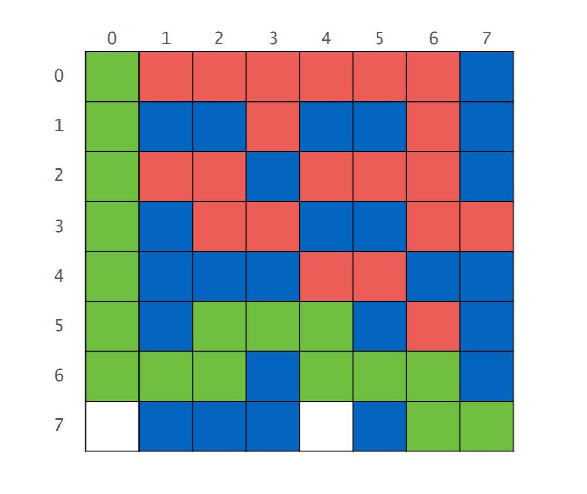
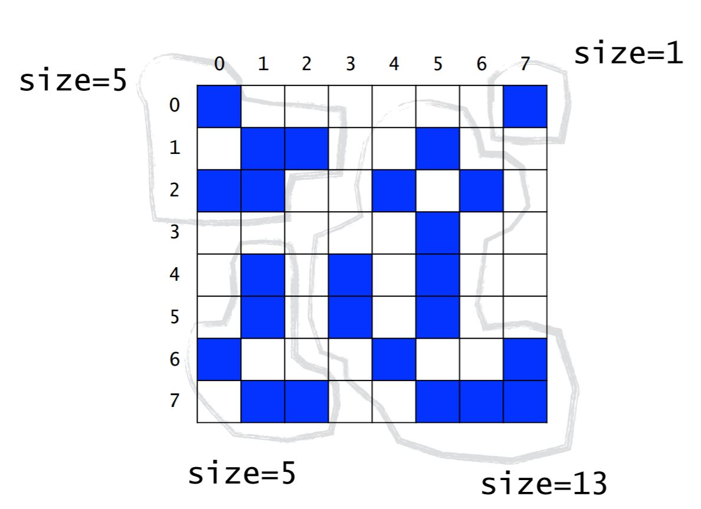
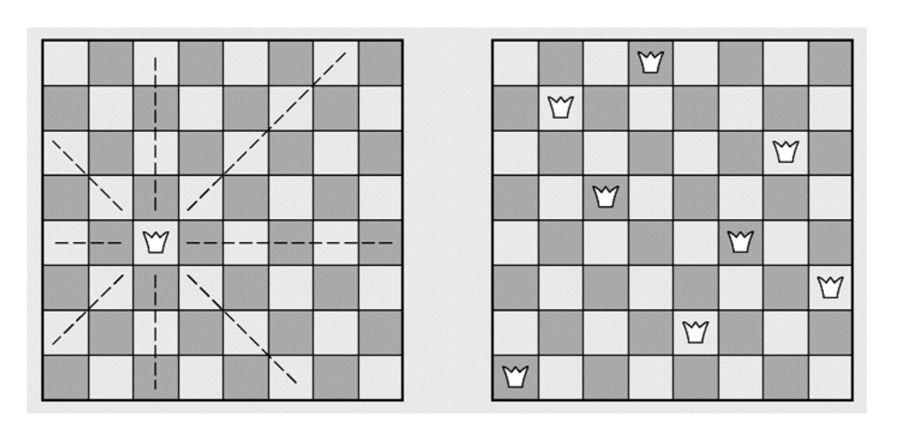
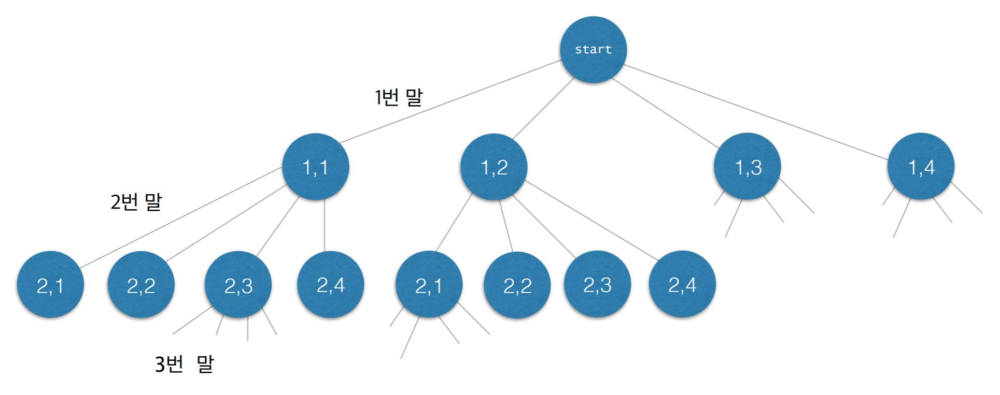
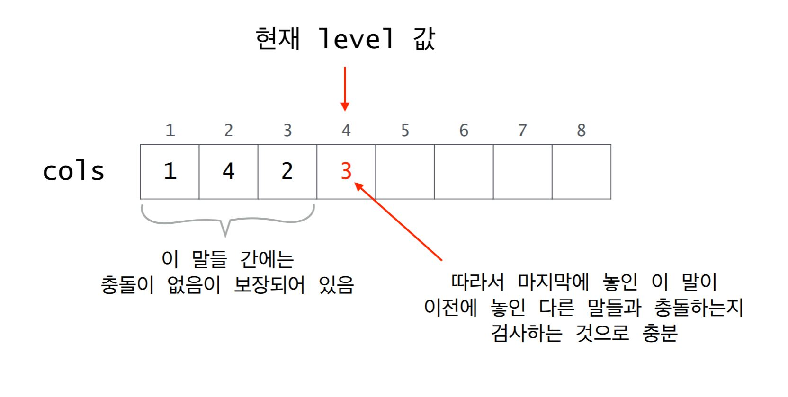
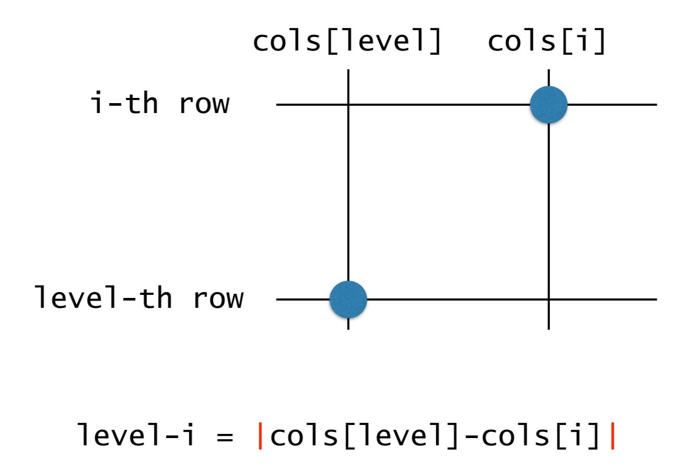

# Recursion
> 자기 자신을 호출하는 함수 / 순환함수
```py
def solution():
    # ...
    solution()
```

<br>
<hr>
<br>

## Recursion 조건
1. 적어도 하나의 종료 조건이 존재해야 한다.
2. 재귀를 반복하면 최종적으로 하나의 종료 조건에 도달해야 한다.

<br>
<hr>
<br>

## Recursion 대표 예제
### n까지 더하기
```py
# 0 ~ n 까지의 합을 구하기
def recursionSum(n):
    # 종료조건 : n이 0이라면 0을 반환한다.
    if n == 0:
        return 0
    # n이 0보다 크다면 현재의 n값에 재귀함수(n - 1)을 더한다.
    else:
        return n + recursionSum(n - 1)

# 검증
print(recursionSum(4))
```

<br>

### Factorial : n!
```py
# 1 ~ n까지의 곱 구하기
def factorial(n):
    # 종료조건 : n이 0이라면 1을 반환한다.
    if n == 0:
        return 1
    # n이 0보다 크다면 현재의 n값에 재귀함수(n - 1)을 곱한다.
    else:
        return n * factorial(n - 1)
        
# 검증
print(factorial(4))
```

<br>

### n의 x제곱 구하기
```py
# n의 x제곱 구하기
def power(n, x):
    # 종료조건 : n이 0이라면 1을 반환한다.
    if n == 0:
        return 1
    # n이 0보다 크다면 제수 x값에 재귀함수(n - 1, x)을 곱한다.
    else:
        return x * power(n - 1, x)

# 검증
print(power(4, 3))
```

<br>

### Fibonacci Number
```py
# 피보나치 수 구하기
def fibonacci(n):
    # 종료조건 : n - 2가 0보다 작아질 경우 2를 반환한다.
    if n < 2:
        return n
    # n - 2가 0보다 크다면 각각 재귀함수를 호출하여 더한다.
    else:
        return fibonacci(n - 1) + fibonacci(n - 2)

# 검증
print(fibonacci(4))
```

<br>

### 최대공약수 : Euclid Method
```py
# m >= n인 두 양의 정수 m과 n에 대해 m이 n의 배수이면 euclid(m, n) = n이다.
# 그렇지 않다면 euclid(m, n) = euclid(n, m % n)이다.
def euclid(m, n):
    # m 이 n 보다 크다면 임시 변수를 통해 값을 치환한다.
    if m < n:
        t = m
        m = n
        n = t
    
    # m과 n을 나눈 뒤 나머지가 0이라면 최대 공약수이다.
    if m % n == 0:
        return n
    # 위에서 값을 치환했으므로 변수를 계산한 뒤 재귀함수를 호출한다.
    else:
        return euclid(n, m % n)

# 검증
print(euclid(180, 8))
```
```py
# 단순한 버전
def euclid2(m, n):
    if n == 0:
        return m
    else:
        return euclid2(n, m % n)

# 검증
print(euclid2(180, 8))
```

<br>
<hr>
<br>

## Recursion 사고
> Recursion은 수학 함수 계산 뿐만 아니라 많은 문제들을 해결할 수 있다.

- 문자열의 길이를 계산하기
    ```py
    '''
    if the string is empty
        return 0
    else
        return 1 plus the length of ther string that 
        excludes the first character
    '''
    def legnth(str):
        if str == "":
            return 0
        else:
            return 1 + length(str[1:])
    ```

- 문자열 출력
    ```py
    def printChars(str):
        if len(str) == 0:
            return
        else:
            print(str[:1], end="")  # 아래와 비교 1
            printChars(str[1:]) # 아래와 비교 2
    ```

- 문자열을 뒤집어 프린트
    ```py
    def printCharReverse(str):
        if len(str) == 0:
            return
        else:
            printCharReverse(str[1:])
            print(str[:1], end="")
    ```

- 2진수로 변환하여 출력하기 : 음이 아닌 정수 n을 이진수로 변환하여 출력
    ```py
    def printInBinary(n):
        if n < 2:
            print(n, end="")
        else:
            # n을 2로 나눈 몫을 먼저 2진수로 변환하여 인쇄
            printInBinary(n // 2)
            # n을 2로 나눈 나머지를 인쇄
            print(n % 2, end="")
    ```

- 배열의 합 구하기
    ```py
    def sum(n, array):
        if n <= 0:
            return 0
        else:
            return sum(n - 1, array) + array[n-1]
    ```

<br>
<hr>
<br>

## Recursion vs. Iteration
- 모든 순환 함수는 반복문(iteration)으로 변경할 수 있다.
    - 물론 이 역도 성립한다. 즉, 모든 반복문은 recuresion으로 표현이 가능하다.
- 순환 함수는 복잡한 알고리즘을 단순하고 알기 쉽게 표현한다.
    - 단, 함수 호출에 따른 오버헤드가 존재한다(매개변수 전달, 액티베이션 프레임 생성 등).

<br>
<hr>
<br>

## Recursion 설계
> 최소 하나의 base case(순환되지 않고 종료되는 case)가 존재해야 한다.
> - 모든 case는 결국 base case로 수렴해야 한다.

### 암시적(implicit) 매개변수를 명시적(explicit) 매개 변수로 변환한다.
- 순차 탐색
    ```py
    # 변경 전
    def search(data, n, target):
        for i in range(n):
            if data[i] == target:
                return i
        return -1
    ```
    - 해당 함수는 data[0]에서 data[n-1] 사이의 target을 검색한다.
    - 검색 구간의 시작 인덱스 0은 보통 생략되므로 암시적인 매개변수이다.

    <br>
    
    ```py
    # 변경 후
    def search(data, start, end, target):
        if start > end:
            return -1
        elif taret == data[start]:
            return start
        else:
            return search(data, start + 1, end, target)
    ```
    - 해당 함수는 data[start]에서 data[end] 사이의 target을 검색한다.
    - 검색 구간의 시작점을 명시적으로 지정한다.
    - `search(data, 0, len(data) - 1, target)`으로 호출하면 변경 전의 함수와 동일하게 작동한다.

    <br>

    ```py
    # 다른 버전 : binary search와는 다름
    def search(data, start, end, target):
        if start > end:
            return -1
        else:
            middle = (start + end) // 2
            if data[middle] == target:
                return middle
            index = search(data, start, middle - 1, target)
            if index != -1:
                return index
            else:
                return search(data, middle + 1, end, target)
    ```

<br>

- 최댓값 찾기
    ```py
    def findMax(data, start, end):
        if start == end:
            return data[start]
        else:
            return max(data[start], findMax(data, start + 1, end))
    ```
    - 해당 함수는 data[start]에서 data[end] 사이의 최댓값을 찾아 반환한다.
        - `start <= end`라고 가정한다.

    <br>

    ```py
    # 다른 버전
    def findMax(data, start, end):
        if start == end:
            return data[start]
        else:
            middle = (start + end) // 2
            max1 = findMax(data, start, middle)
            max2 = findMax(data, middle + 1, end)
            return max(max1, max2)
    ```

<br>
<hr>
<br>

## Recursion 응용
### 미로 찾기
> 현재 위치에서 출구까지 가는 경로 찾기
1. 현재 위치가 출구여야 한다.
2. 1이 아니라면 이웃한 셀들 중 하나에서 현재 위치를 지나지 않고 출구까지 가는 경로가 있어야 한다.

<br>

- 첫 번째 설계 : 방문한 장소를 재방문하여 무한 루프에 빠질 수 있음
    ```py
    boolean findPath(x, y)
        # 현재 위치가 출구라면 True
        if(x, y) is the exit
            return True
        else
            # 이웃한 셀을 검사
            for each neighbouring cell (x', y') of (x, y) do
                ## 이웃한 셀이 통로라면 검사, 아니라면 False
                if(x', y') is on then pathway
                    if findPath(x', y')
                        return True
            return False
    ```

<br>

- 두 번째 설계 : 검사한 위치를 저장하여 무한 루프를 방지
    ```py
    boolean findPath(x, y)
        # 현재 위치가 출구라면 True
        if(x, y) is the exit
            return True
        else
            # 검사한 위치를 마크(저장)
            mark(x, y) as a visited cell
            # 이웃한 셀을 검사
            for each neighbouring cell (x', y') of (x, y) do
                ## 이웃한 셀이 통로이고 방문하지 않았다면 검사, 아니라면 False
                if(x', y') is on then pathway and not visited
                    if findPath(x', y')
                        return True
            return False
    ```

<br>

- 세 번째 설계 : 함수는 더 많이 호출하나 코드는 간결해짐
    ```py
    boolean findPath(x, y)
        ## 이웃한 셀이 통로이고 방문하지 않았다면 검사, 아니라면 False
        if(x, y) is either on the wall or a visited cell
            return False
        # 현재 위치가 출구라면 True
        else if(x, y) is the exit
            return True
        else
            # 검사한 위치를 마크(저장)
            mark(x, y) as a visited cell
            # 이웃한 셀을 검사
            for each neighbouring cell (x', y') of (x, y) do
                if findPath(x', y')
                    return True
            return False
    ```

<br>

- 문제 해결
    ```py
    # 미로의 크기
    N = 8
    # 통로
    PATHWAY_VALUE = 0
    # 벽
    WALL_VALUE = 1
    # 방문(검사)했으며 출구까지의 경로에 있지 않다고 판별된 CELL
    BLOCKED_VALUE = 2
    # 방문(검사)했으며 아직 출구로 가는 경로가 될 가능성이 있는 CELL
    PATH_VALUE = 3

    maze = [
        [0, 0, 0, 0, 0, 0, 0, 1],
        [0, 1, 1, 0, 1, 1, 0, 1],
        [0, 0, 0, 1, 0, 0, 0, 1],
        [0, 1, 0, 0, 1, 1, 0, 0],
        [0, 1, 1, 1, 0, 0, 1, 1],
        [0, 1, 0, 0, 0, 1, 0, 1],
        [0, 0, 0, 1, 0, 0, 0, 1],
        [0, 1, 1, 1, 0, 1, 0, 0],
    ]
    
    def findMazePath(x, y):
        # x-1, y-1 등 검사하므로 x, y의 음수 여부를 체크하는 로직이 필요
        if x < 0 or y < 0 or x >= N or y>= N:
            return False
        elif maze[x][y] != PATHWAY_VALUE:
            return False
        elif x == N - 1 and y == N - 1:
            maze[x][y] = PATH_VALUE
            return True
        else:
            maze[x][y] = PATH_VALUE
            if findMazePath(x - 1, y) or findMazePath(x, y + 1) or findMazePath(x + 1, y) or findMazePath(x, y - 1):
                return True
            maze[x][y] = BLOCKED_VALUE
            return False


    print(maze)
    # 첫 번째 좌표 호출로 시작
    findMazePath(0, 0)
    print(maze)
    ```

<br>

- 결과

<div align=center>



</div>

<br>

### Counting Cells in a Blob
- 문제 정의
<div align=center>

<h4>[5, 1, 5, 13] 사이즈의 4개 Blob</h4>



<p>Binary 이미지이며, 서로 연결된 픽셀의 집합을 Blob이라 부른다.</p>
    <p>상하좌우 및 대각선도 연결된 것으로 간주한다.</p>

</div>

<br>

- 사고하기 1 : 현재 픽셀(x, y)이 속한 Blob의 크기를 카운트하기 위해서는?
    1. 현재 픽셀이 image color가 아니라면 0을 반환한다.
    2. 현재 픽셀이 image color라면 먼저 현재 픽셀을 카운트한다(count=1).
    3. 현재 픽셀이 중복 카운트 되는 것을 방지하기 위해서 다른 색으로 칠한다.
    4. 현재 픽셀에 이웃한 모든 픽셀들에 대해 그 픽셀이 속한 Blob의 크기를 카운트하여 기존 카운트에 더한다.
    5. 카운트를 반환한다.

<br>

- 사고하기 2 : 따라가기
    1. `x = 5, y = 3`이라 가정하고 해당 픽셀이 포함된 Blob의 크기를 계산해보자.
    2. `count`는 `0`으로 `초기화`한다.
    3. 현재 cell을 `중복 카운트되는 것을 방지하기 위해 다른 색`으로 칠하고 `count를 1 증가`한다.
    4. 인접한 8개의 픽셀 각각에 대해 순서대로 그 픽셀이 포함된 Blob의 크기를 count한다. `시계 방향(북, 북동, 동...)`으로 고려한다.
    5. 북쪽 픽셀이 포함된 Blob의 크기는 0이므로 count 값은 변하지 않는다.
    6. 북동쪽 픽셀이 속한 Blob을 count하고, count 된 픽셀들을 색칠한다.
    7. 3개의 픽셀이 Blob에 속한다. 즉 count는 `1 + 3 = 4`이다.
    8. 동쪽과 남동쪽 픽셀이 포함된 Blob의 크기는 0이므로 count 값은 변하지 않는다.
    9. 남쪽 픽셀이 속한 Blob을 count하고, count 된 픽셀들을 색칠한다.
    10. 9개의 픽셀이 Blob에 속한다. 즉 count는 `4 + 9 = 13`이다.
    11. 남서, 서, 북서 방향의 픽셀이 속한 Blob은 없거나 혹은 이미 count 되었다.
    12. 최종적으로 x = 5, y = 3의 픽셀이 가진 Blob의 크기는 13이다.

<br>

- 사고하기 3 : pseudo code 작성하기
    ```py
    Algorithm for countCells(x, y)
        if the pixel(x, y) is outside the grid
            the result is 0
        else if pixel(x, y) is not an image pixel or already counted
            the result is 0
        else
            # 이미 카운트 되었음을 표시한다.
            set the color of the pixel(x, y) to a red color
            the result is 1 plus the number of cells in each piece of
                the blob that includes a nearest neighbour
    ```

<br>

- 문제 해결
    ```py
    # 주어진 그리드의 크기
    N = 8
    # Blob이 아닌 픽셀
    BACKGROUND_COLOR = 0
    # Blob인 픽셀
    IMAGE_COLOR = 1
    # 이미 횟수를 센 픽셀
    ALREADY_COUNTED = 2

    grid = [
        [1, 0, 0, 0, 0, 0, 0, 1],
        [0, 1, 1, 0, 0, 1, 0, 0],
        [1, 1, 0, 0, 1, 0, 1, 0],
        [0, 0, 0, 0, 0, 1, 0, 0],
        [0, 1, 0, 1, 0, 1, 0, 0],
        [0, 1, 0, 1, 0, 1, 0, 0],
        [1, 0, 0, 0, 1, 0, 0, 1],
        [0, 1, 1, 0, 0, 1, 1, 1],
    ]

    def countCells(x, y):
        if x < 0 or x >= N or y < 0 or y >= N:
            return 0
        elif grid[x][y] != IMAGE_COLOR:
            return 0
        else:
            grid[x][y] = ALREADY_COUNTED
            return 1 + countCells(x - 1, y + 1) + countCells(x, y + 1)
                     + countCells(x + 1, y + 1) + countCells(x - 1, y)
                     + countCells(x + 1, y) + countCells(x - 1, y - 1)
                     + countCells(x, y - 1) + countCells(x + 1, y - 1)
    ```

<br>

### N-Queens
- 문제 정의
<div align=center>

<h4>N의 크기를 가진 체스판에서 퀸을 배치하기</h4>



<p>퀸의 위치는 움직일 수 있는 경로가 겹치면 안 된다.</p>

</div>

<br>

- 사고하기 1 : 퀸을 놓기 위해서는?
    > **되찾기 기법(Back Tracking)** : 최근에 내렸던 결정을 번복하고 다른 선택을 하는 방식을 반복하여 해결한다.
    1. 크기 N인 체스판에서 퀸의 위치는 (x, y)라고 가정하자. (0, 0) 위치에 퀸을 배치한 뒤 동선이 겹치지 않는 위치에 다음 퀸을 배치한다.
    2. 첫 번째, 두 번째 퀸을 배치한 위치에 따라 세 번째 말을 놓을 수 있는 위치가 달라진다.
    3. 만약 세 번째 퀸을 배치할 수 없는 상황이라면, 그 전에 움직였던 퀸을 새로 배치해야 한다.

<br>

- 사고하기 2 : 시각화
<div align=center>

<h4>상태공간 트리</h4>



<p>찾고자 하는 해를 포함하는 트리</p>
<p>해가 존재한다면 반드시 트리의 한 노드에 해당하므로 트리를 체계적으로 탐색하면 해를 구할 수 있다.</p>

</div>

<br>

- 사고하기 3 : 따라가기
    1. 상태공간트리의 모든 노드를 탐색할 필요는 없다.
    2. 전부 퀸을 놓을 수 없는 위치 같은 조건에 부합하지 않는다면 하위 노드까지 확인하지 않아도 된다.
    3. non-promising : infeasible한가? 이미 퀸이 충돌되어 더 이상 확인할 필요가 없는 노드인가를 판단하는 척도를 통해 선택과 탐색에 걸리는 시간을 단축할 수 있다.
    4. 즉, 가장 깊은 노드(퀸을 놓을 수 있는 위치가 많은 하위 트리)를 우선 탐색한다.

<br>

- 사고하기 4 : pseudo code 작성하기
    > Back Tracking을 구현하는 두 가지 방법은 Recursion과 Stack 자료구조를 사용하는 것이다.
    > - 일반적으로 Recursion이 간단하기 때문에 이 방법으로 많이 해결한다.
    
    <br>

    ```py
    # 말이 놓인 위치를 기록할 전역 변수를 선언한다.
    cols[] = size [N+1]
    # 매개변수에는 현재 트리의 어떤 노드에 있는지 지정해야 한다.
    # 따라서 매개변수 level은 현재 노드의 레벨을 표현한다.
    # cols[i] = j는 i번 말이 (i행, j열)에 놓였음을 의미한다.
    boolean queens(level)
        # 1부터 level까지 놓을 퀸의 위치는 정해졌다라는 매개변수로,
        # 그 위치는 전역변수 cols에 기록한다.

        # 실패 : 이미 탐색할 가치가 없는 노드이므로 하위 트리까지 탐색하지 않는다.
        '''
        if non-promising
            report failure and return
        '''
        if !promising(level)
            return false
        # 성공 : 찾고 있던 답인지 확인한다.
        # promising 테스트를 통과했다는 가정 하에 level == N이면 모든 말이 놓였다는 의미이다.
        '''
        else if success
            report answer and return
        '''
        else if level == N
            return true
        # 재귀적으로 자식 노드를 탐색한다.
        # level + 1 번째 퀸을 각 열에 배치하고 recursion을 호출한다.
        '''
        else
            visit children recursively
        '''
        for i in range(1, N)
            cols[level + 1] = i
            if queens(level + 1)
                return true
        return false
    ```

<br>

- 사고하기 5 : pseudo code를 분할하여 생각하기
    > Promising Test
    <div align=center>

    

    </div>

    <br>

    ```py
    boolean promising(level)
        for i in range(1, level)
            # 같은 열에 놓여 있는지 검사
            if cols[i] == cols[level]
                return false
            # 같은 대각선에 놓여 있는지 검사
            '''
            else if on the same diagonal
                return false
            '''
            else if level - i == abs(cols[level] - cols[i])
                return false
        return true
    ```

    <br>

    <div align=center>

    

    <p>두 개의 퀸이 동일한 대각선이라는 말은 인접한 좌표의 거리가 같다는 것</p>
    <p>대각선은 반대일 수도 있으니 절대값을 계산한다.</p>

    </div>

    <br>

- 문제 해결
    ```py
    # 체스판의 크기
    N : int = 8
    # 퀸의 위치를 저장할 배열 선언 / 초기화
    cols = [0] * (N + 1)

    def queens(level:int):
        # 이미 퀸이 존재하거나, 퀸의 경로가 있는지 검증한다.
        if not promising(level):
            return False
        # 체스판의 크기와 동일한 단계에 도달하면 완료!
        elif N == level:
            for i in range(1, N + 1):
                print(i, end="")
                print(",", end="")
                print(cols[i])
            return True
        else:
            # 일단 퀸을 둘 수 있는 상황으로, 배열에 해당 위치를 저장하고 단계를 증가시켜 재귀한다.
            for i in range(1, N + 1):
                # 해당 단계의 퀸 위치 저장한다.
                cols[level + 1] = i
                # 단계를 증가한 뒤 재귀한다.
                if(queens(level + 1)):
                    return True
            # False가 반환되는 경우는 promising-검증에서 걸렸을 때이다.
            return False

    def promising(level:int):
        # 단계만큼 순회한다.
        for i in range(1, level):
            # 퀸의 위치가 저장된 배열에 해당 단계의 퀸 위치가 존재하면 중지한다.
            if cols[i] == cols[level]:
                return False
            # 퀸의 대각선 경로 검증 : 해당 단계의 퀸을 기준으로 북서, 북동, 남서, 남동쪽을 확인한다.
            elif level - i == abs(cols[level] - cols[i]):
                return False
        # 검증 단계에서 통과한다면 퀸을 배치할 수 있다.
        return True

    queens(0)
    ```
