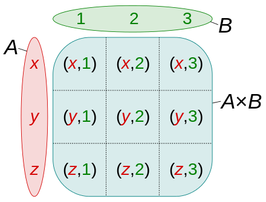

# Pythonic : 다양한 Comprehension 사용법

Comprehension은 list, dict, set과 같은 iterable 객체를 생성할 수 있는 파이썬만의 독특한 sugar 문법입니다. 잘 사용하면 굉장히 깔끔한 코드를 작성할 수 있고 성능상 이점이 있습니다.

무엇보다 코드 리뷰를 하는 입장에서 파이써닉한 코드처럼 보이고 그 코드를 짠 사람도 아주 프로페셔널해 보인다는 아주 큰 장점이 있습니다.

성능상 이점이 있는 이유는 Function Call 비용을 크게 줄여서 그렇습니다. 사실 코딩 테스트에서 큰 이점이 있는 유의미한 성능 차는 아닙니다. 자세한 이유는 다음 링크를 참고해보세요. https://jeongukjae.github.io/posts/inspecting-list-comprehension/

다음과 같이 대표적인 세 가지 Comprehension이 존재합니다.

1. List Comprehension
2. Dictionary Comprehension
3. Set Comprehension
   이 세 가지 외에도 Generator Expression도 포함되지만 이 문서에서는 생략하겠습니다. :)

## List Comprehension

List Comprehension은 리스트를 만들 수 있는 문법입니다. 먼저 예제를 보겠습니다.

```py
lst = [0] * 10
for i in range(1, 10):
    lst[i] = i * 2
```

보통 프로그래밍 언어를 사용하여 2의 배수가 담긴 리스트를 만들기 위해선 for 를 사용하여 할당하는 방법을 많이 사용합니다. 파이썬에선 이 초기화를 List Comprehension을 이용하여 간단히 만들 수 있습니다.

```py
lst = [i * 2 for i in range(1, 10)]
# [2, 4, 6, 8, 10, 12, 14, 16, 18]
```

보시는 것 처럼 한 줄로 아주 간단히 만들었습니다. List Comprehension은 초기화하는 것 외에도 기존 리스트를 변형하거나 조건을 넣어 요소를 필터링하는 것이 가능합니다.

```py
lst = [i for i in range(1, 10)]
odd = [i for i in range(1, 10) if i % 2 == 0] # 홀수만 들어간다.
square = [i ** 2 for i in lst] # 기존 리스트를 이용하여 제곱수가 들어간 리스트를 만들었다.
# [1, 2, 3, 4, 5, 6, 7, 8, 9]
# [2, 4, 6, 8]
# [1, 4, 9, 16, 25, 36, 49, 64, 81]
```

## Dictionary Comprehension

Dictionary Comprehension은 dict를 만들 수 있는 문법입니다.

```py
names = ['키보드', '마우스', '모니터']
prices = [150000, 90000, 450000]
products = {key: value for key, value in zip(names, prices)}
# {'키보드': 150000, '마우스': 90000, '모니터': 450000}
```

Dictionary Comprehension도 마찬가지로 기존 dict를 변경하거나 if를 이용하여 필터링하는 것이 가능합니다.

## Set Comprehension

Set Comprehension은 set을 만들 수 있는 문법입니다.

```py
lst = [1, 3, 5, 7, 9, 3, 5, 2, 6, 4, 1, 8, 2]
uniq = {i for i in lst} # 중복이 제거된다.
# set([1, 2, 3, 4, 5, 6, 7, 8, 9])
```

# Pythonic : defaultdict 사용법

defaultdict는 딕셔너리를 만들어주는 함수입니다. dict와 차이점은 새롭게 키를 지정할 때 초기값을 제공한다는 점입니다.

다음 코드처럼 기존 dict은 초기값을 넣어줘야만 접근이 가능합니다.

```py
d = dict()
names = ['Lee', 'James', 'John', 'Smith', 'Lee', 'James']
for name in names:
    if name in d: # 초기값이 없으면 에러가 발생하기 때문에 if로 체크합니다.
        d[name] += 1
    else:
        d[name] = 1
```

여기서 defaultdict를 사용하면 코드를 깔끔하게 만들 수 있습니다.

```py
from collections import defaultdict
d = defaultdict(int) # 초기값을 int로 설정합니다. (여기서 0으로 초기화됩니다)
names = ['Lee', 'James', 'John', 'Smith', 'Lee', 'James']
for name in names:
    d[name] += 1
```

`defaultdict`은 `int`가 아닌 다른 타입도 초기화를 제공합니다.

```py
from collections import defaultdict

list_dict = defaultdict(list)
list_dict['key'] += [1, 3, 5]
print(list_dict['key']) # [1, 3, 5]

set_dict = defaultdict(set)
set_dict['key'].update((1, 3, 5, 3, 2, 8))
print(set_dict['key']) # {1, 2, 3, 5, 8}
```

# Pythonic : 2차원 리스트 생성 방법

종종 문제를 풀기 위해 2차원 리스트를 만들어야하는 상황이 발생합니다.
파이썬에선 리스트의 크기를 미리 지정하도록 생성 할 수 있는 문법이 제공됩니다.

```py
lst = [0] * 5
print(lst) # [0, 0, 0, 0, 0]
```

마찬가지로 2차원 리스트를 생성할 때도 비슷하게 응용할 수 있습니다.

```py
lst = [[0] * 5 for __ in range(5)]
print(lst) # [[0, 0, 0, 0, 0], [0, 0, 0, 0, 0], [0, 0, 0, 0, 0], [0, 0, 0, 0, 0], [0, 0, 0, 0, 0]]
```

참고로 다음과 같이 사용하면 안됩니다.

```py
lst = [[0] * 5] * 5
print(lst) # [[0, 0, 0, 0, 0], [0, 0, 0, 0, 0], [0, 0, 0, 0, 0], [0, 0, 0, 0, 0], [0, 0, 0, 0, 0]]
lst[0][0] = 1
print(lst) # [[1, 0, 0, 0, 0], [1, 0, 0, 0, 0], [1, 0, 0, 0, 0], [1, 0, 0, 0, 0], [1, 0, 0, 0, 0]]
```

위와 같이 첫 번째 요소를 변경했을 때 나머지 요소가 변경되는 이유는 1차원 리스트가 새롭게 생성된 것이 아닌 복제가 되어서 그렇습니다. 같은 주소를 바라보고 있기 때문에 나머지 리스트의 값도 변경된 것 처럼 보이는 것 입니다. :)

# Pythonic : 간단하게 2차원 리스트를 1차원 리스트로 변환하기

가끔 문제를 풀다보면 2차원 리스트를 1차원 리스트로 변환해야할 때가 있습니다.

그럴때 반복문을 통해 새로 리스트를 생성하거나 built-in 모듈인 itertools를 이용하곤 합니다.

그런데 정말 간단한 방법이 있습니다. 바로 `sum` 함수를 이용하는 방법입니다.

```py
nested_list = [[1, 2, 3], [4, 5, 6]]
flat_list = sum(nested_list, [])
print(flat_list) # [1, 2, 3, 4, 5, 6]
```

이 방법은 start 값을 비어있는 리스트로 설정하는 방법으로 sum이 빈 리스트에 요소를 더하면서 리스트가 합쳐지게 됩니다.

# Pythonic : 쉽게 Swap 하기

보통 다른 언어를 먼저 공부하셨다면 다음과 같이 swap을 구현합니다.

```js
a = 3;
b = 5;

temp = a;
a = b;
b = temp;
// a = 5, b = 3, temp = 3
```

파이썬은 조금 더 직관적이고 쉽게 swap을 구현할 수 있습니다.

```py
a = 3
b = 5

a, b = b, a
# a = 5, b = 3
```

# Pythonic : itertools 모듈을 이용한 조합

파이썬에선 itertools 모듈을 제공하여 iteration한(반복되는) 값을 쉽게 만들 수 있습니다.

여기서는 itertools 모듈을 이용하여 조합형 이터레이터를 만드는 법을 알아보겠습니다.

## product를 이용하여 곱집합(데카르트 곱) 구하기

곱집합은 다음과 같이 여러 집합에서 각 원소를 선택하여 만들 수 있는 모든 튜플을 모아놓은 집합을 의미합니다.

<div align=center>



</div>

한 마디로 선택할 수 있는 모든 경우의 수라고 할 수 있겠네요. :)

이 집합을 쉽게 구하기 위해서 product 함수를 사용할 수 있습니다.

```py
from itertools import product

p = product(['x', 'y', 'z'], [1, 2, 3])
print(list(p)) #	[('x', 1), ('x', 2), ('x', 3), ('y', 1), ('y', 2), ('y', 3), ('z', 1), ('z', 2), ('z', 3)]
```

## combinations를 이용한 조합 구하기

조합은 집합에서 서로다른 각 요소를 선택하여 만들 수 있는 경우의 수를 의미합니다.
5개 요소에서 5개를 전부 선택할 수도, 3개만 선택할 수도 있습니다.
막상 구현하려면 꽤 까다로운데요, 파이썬에선 combinations 함수를 통해 쉽게 구할 수 있습니다.

```py
from itertools import combinations

c = combinations(['a', 'b', 'c', 'd', 'e'], 3) # 5개 요소 중 3개 선택
print(list(c))
# [('a', 'b', 'c'), ('a', 'b', 'd'), ('a', 'b', 'e'), ('a', 'c', 'd'), ('a', 'c', 'e'), ('a', 'd', 'e'), ('b', 'c', 'd'), ('b', 'c', 'e'), ('b', 'd', 'e'), ('c', 'd', 'e')]
c = combinations(['a', 'b', 'c', 'd', 'e'], 5) # 5개 요소 중 5개 선택
print(list(c)) # [('a', 'b', 'c', 'd', 'e')]
```

## permutation를 통해 순열 구하기

순열은 집합에서 각 요소를 뽑아 배치할 수 있는 경우의 수라고 볼 수 있습니다. 조합과 다르게 순서가 중요합니다.
예를들어 ABC의 순열을 구하면 ABC, ACB, BAC, BCA, CAB, CBA 6개가 가능합니다.

```py
from itertools import permutations

p = permutations(['a', 'b', 'c'], 2) # 3개 요소 중 2개를 선택한 순열
print(list(p)) # [('a', 'b'), ('a', 'c'), ('b', 'a'), ('b', 'c'), ('c', 'a'), ('c', 'b')]
p = permutations(['a', 'b', 'c']) # 3개 요소 중 3개를 선택한 순열
print(list(p)) # [('a', 'b', 'c'), ('a', 'c', 'b'), ('b', 'a', 'c'), ('b', 'c', 'a'), ('c', 'a', 'b'), ('c', 'b', 'a')]
```

# 퍼포먼스 측정 방법

퍼포먼스를 측정하기 위해선 시간을 정밀하게 측정할 수 있는 함수가 필요합니다.
파이썬에선 프로파일링을 위해 `process_time`과 `perf_counter` 두 함수를 제공합니다.

여기선 process_time을 이용하여 시간 측정하는 예제를 살펴보겠습니다.

```py
import time

def solution(participant, completion):
    start = time.process_time() # 로직 시작
    participant.sort()
    completion.sort()
    for par, com in zip(participant, completion):
        if par != com:
            return par
    end = time.process_time() # 로직 종료
    print(end - start) # 걸린 시간 출력

    return participant[-1]
```

위 코드 처럼 process_time은 time 모듈에 속해있으며 사용되는 시점의 시간을 반환합니다.
앞으로 푸신 알고리즘 코드에 대한 성능 측정과 비교가 필요하다면 process_time을 이용해보세요. :)

# 문제 유형 파악하기

## 문제를 읽기전에 무조건 입출력 제한을 보자!

- 문제를 자세히 읽기전에 입출력 제한을 보는것이 중요합니다. 특히 입력 제한을 보면 어떤 시간복잡도 내에 풀어야 하는지 알 수 있습니다.
  예를들아 입력이 100 이하인 경우 높은 확률로 완전 탐색 문제입니다. 시간복잡도 O(n^3) 까지도 감당이 가능하기 때문에 플로이드 워셜과 같이 시간복잡도가 높은 알고리즘도 사용이 가능합니다. 보통 다음과 같이 판단하시면 됩니다.

### 입력이 100 이하인 경우

- 완전 탐색
- 백트래킹

### 입력이 10,000 이하인 경우

- 최대 O(n^2) 이내로 끝내야하는 문제
- 문제에 따라 O(n^2 log n)까지는 허용
- n\*n 2차원 리스트를 모두 순회해야하는 문제가 많음

### 입력이 1,000,000 이하인 경우

- 최대 O(n log n)으로 끝내야하는 문제
- 힙, 우선순위 큐
- 정렬
- 동적 계획법
- 위상 정렬
- 다익스트라 알고리즘

### 입력이 100,000,000 이하인 경우

- 최대 O(n)으로 끝내야하는 문제
- 동적 계획법
- 그리디

### 그 이상인 경우

- 최대 O(log n)으로 끝내야하는 문제가 많음
- 거의 안나오는 문제 유형
- 이진탐색

## 문제 유형

100%는 아니지만 높은 확률이라고 봐주시면 좋습니다. :)
코딩 테스트에서 많이 나오는 유형을 추렸습니다.

### 입력값이 작은 문제

위에서 적었듯 높은 확률로 완전 탐색 혹은 백트래킹 문제입니다.
구현력이 중요한 문제로 출제될 가능성이 높습니다.

### 지도가 주어지고 채워진 영역을 찾아야하는 경우

높은 확률로 BFS, DFS 문제입니다. FloodFill과 같이 정직한 방식으로 나오거나 전염병 문제나 치즈 문제(https://www.acmicpc.net/problem/2636)처럼 살짝 변형되서 나오는 경우가 있습니다.

### 그래프 그림이 있는 경우

이 경우 높은 확률로 세 가지 유형 중 하나입니다.

1. 최단 거리 찾기
2. 최소 신장 트리
3. 위상 정렬

문제에서 "가장 빠른 길", "최단 거리"와 비슷한 키워드가 나온다면 당연히 최단 거리 찾기 유형이고 "X 비용 내로 갈 수 있는 길을 찾아라"와 같은 키워드가 나와도 최단 거리 찾기 유형입니다. 다익스트라, BFS, DFS 등이 사용될 수 있습니다.

최소 신장 트리 문제는 보통 "가장 저렴한 방법으로 모든 경로 연결해라" 등의 키워드로 출제됩니다. 경로가 아니라 통신망, 전송 시간, 회로, 배관 등 다양한 용어로 나올 수는 있지만 핵심은 모든 경로를 "가장 싸게 연결해라"입니다. 그래프는 양방향일수도 단방향일수도 있습니다. 크루스칼, 프림 알고리즘을 사용할 수 있습니다.

위상 정렬은 순서를 정해야할 때 사용됩니다. 보통 "순서", "차례" 등의 키워드가 나오면 위상 정렬 문제입니다.

### X라는 조건을 만족하는 가장 최대/최소값을 찾아라

이 경우 높은 확률로 결정 문제입니다. 파라메트릭 서치를 이용해서 풀 수 있습니다.

### 실시간으로 정렬이 이루어져야 하는 경우

높은 확률로 우선순위 큐 혹은 힙을 사용하는 문제입니다.

### DP 문제

보통 완전 탐색처럼 시간이 오래걸리면 안되는데 특별한 알고리즘을 사용하는 문제가 아닐거 같을 때는 높은 확률로 DP 문제입니다. 다른 문제처럼 "딱봐도 이거네!" 하는 특징이 없어서 보통 문제를 보고 바로 유형을 판단하기 힘든 경우 DP처럼 풀 수 있는지 생각해봐야 합니다. 종이를 꺼내고 다음과 같은 방식으로 해보셔도 괜찮을 것 같습니다.

1. 문제를 따라 먼저 초기값을 적는다.
2. 초기값을 포함해 모든 상태값을 적는다.
3. 현재상태를 통해 다음 값을 구할 수 있는지 판단한다.
4. 혹은 이전 상태들을 통해 현재 값을 구할 수 있는지 판단한다.
   이런식으로 여러 번 해보고 식을 만들 수 있다면 100% DP 문제입니다.

### 문자열이 주어지는 경우

구현력 문제인 경우가 많습니다. 문자열을 자르거나, 붙이거나 탐색하는 문제가 대부분입니다. 문자열을 탐색하는 알고리즘이 필요한 경우 KMP 알고리즘을 사용할 수 있지만 보통 파이썬과 같은 스크립트 언어에선 문자열 탐색이 빌트인으로 존재하기 때문에 구현에만 집중하면 됩니다.

### 현재 상황에서 가장 최적인 선택을 해야하는 경우

문제에서 항상 최적의 선택을 해야하는 경우 혹은 "가장 많은 선택을 할 수 있는", "가장 작은/큰" 등의 키워드가 들어가면 그리디 문제일 가능성이 높습니다. 위에서 잠깐 말했던 최소 신장 트리도 그리디의 일종입니다.
