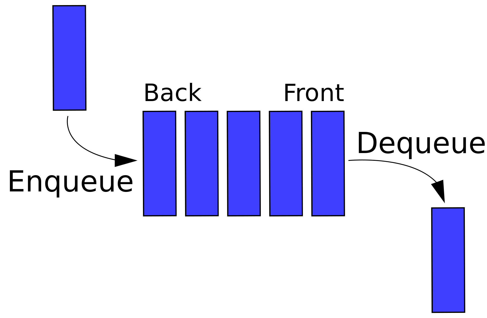
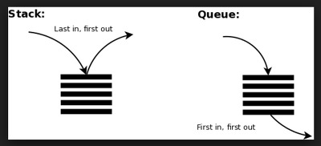
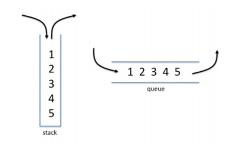
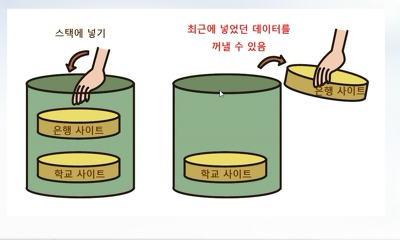

<div align=center>

# 5주차-스택과 큐 자료구조의 구현

</div>

<br>

## 자료구조의 종류
|구분|종류|
|----|----|
|선형구조|선형 리스트(ArrayList), **연결 리스트(LinkedList)**, **스택(Stack)**, **큐(Queue)**, 데크(Deque)|
|비선형구조|트리(Tree), 그래프(Graph)|

<br>

## 연결 리스트(LinkedList)
### 연결 리스트의 개요
- 순서가 존재

- 읽기(Read), 삽입(Insert)과 삭제(Delete)가 임의대로 가능

- 노드의 삽입과 삭제가 용이
  - 트리를 표현하기에 용이

- 기억 공간이 연속적이지 않아도 저장 가능

- 연결을 위한 링크(포인터)가 필요하여 순차 리스트에 비한 기억공간 효율이 적음
  - 이로 인해 접근속도가 느림

- 희소행렬을 링크드 리스트로 표현하면 기억장소 절약 가능
  - 희소행렬 : 많은 항들이 0으로 되어있는 형태

- 단방향 연결 리스트, 양방향 연결 리스트, 이중 연결 리스트가 존재

<br>

<div align=center>


</div>

<br>

### 연결 리스트의 구현
- Java 코드
    ```java
    public class LinkedList<T>
    {
        
        private Node head;
        
        private Node tail;
        
        private int size = 0;
        
        private class Node
        {
            private Object data;
            
            private Node next;
            
            public Node(Object input)
            {
                this.data = input;
                this.next = null;
            }
            
            public String toString()
            {
                return String.valueOf(this.data);
            }
        }
        
        public void addFirst(Object input)
        {
            Node newNode = new Node(input);
            newNode.next = head;
            head = newNode;
            size++;
            if (head.next == null)
            {
                tail = head;
            }
        }
        
        public void addLast(Object input)
        {
            Node newNode = new Node(input);
            if (size == 0)
            {
                addFirst(input);
            }
            else
            {
                tail.next = newNode;
                tail = newNode;
                size++;
            }
        }
        
        // 내부적인 부품이 외부에 노출되면 안됨
        Node node(int index)
        {
            Node x = head;
            for (int i = 0; i < index; i++)
            {
                x = x.next;
            }
            return x;
        }
        
        public void add(int index, Object input)
        {
            if (index == 0)
            {
                addFirst(input);
            }
            else
            {
                Node temp1 = node(index - 1);
                Node temp2 = temp1.next;
                Node newNode = new Node(input);
                temp1.next = newNode;
                newNode.next = temp2;
                size++;
                if (newNode.next == null)
                {
                    tail = newNode;
                }
            }
        }
        
        public String toString()
        {
            if (head == null)
            {
                return "[]";
            }
            
            Node temp = head;
            String str = "[";
            
            while (temp.next != null)
            {
                str += temp.data + ", ";
                temp = temp.next;
            }
            str += temp.data;
            
            return str + "]";
        }
        
        public Object removeFirst()
        {
            Node temp = head;
            head = head.next;
            Object returnData = temp.data;
            temp = null;
            size--;
            return returnData;
        }
        
        public Object remove(int index)
        {
            if (index == 0)
            {
                return removeFirst();
            }
            Node temp = node(index - 1);
            Node todoDeleted = temp.next;
            temp.next = temp.next.next;
            Object returnData = todoDeleted.data;
            if (todoDeleted == tail)
            {
                tail = temp;
            }
            size--;
            return returnData;
        }
        
        public Object removeLast()
        {
            return remove(size - 1);
        }
        
        public int size()
        {
            return size;
        }
        
        public Object get(int index)
        {
            Node temp = node(index);
            return temp.data;
        }
        
        public int indexOf(Object input)
        {
            Node temp = head;
            int index = 0;
            while (temp.data != input)
            {
                temp = temp.next;
                index++;
                if (temp == null)
                {
                    return -1;
                }
            }
            return index;
        }
        
        // 중복되고 정렬되지 않은 링크드 리스트를 정렬시키고 중복을 제거하기
        // 고정된 포인터 방법, 시간은 더 많이 들지만 공간 효율성이 좋다.
        public void removeDups()
        {
            Node newNode = head;
            while (newNode == null && newNode.next != null)
            {
                Node runner = newNode;
                while (runner.next != null)
                {
                    if (newNode.data == runner.next.data)
                    {
                        runner.next = runner.next.next;
                    }
                    else
                    {
                        runner = runner.next;
                    }
                }
                newNode = newNode.next;
            }
        }
    }
    ```

- C# 코드
    ```cs
    public class LinkedList
    {
        private Node head;

        private Node tail;

        private int size = 0;

        private class Node
        {
            public Object data;
            public Node next;
            public Node(Object input)
            {
                this.data = input;
                this.next = null;
            }

            public String toString()
            {
                return Convert.ToString(this.data);
            }
        }

        public void addFirst(Object input)
        {
            Node newNode = new Node(input);
            newNode.next = head;
            head = newNode;
            size++;
            if (head.next == null)
            {
                tail = head;
            }
        }

        public void addLast(Object input)
        {
            Node newNode = new Node(input);
            if (size == 0)
            {
                addFirst(input);
            }
            else
            {
                tail.next = newNode;
                tail = newNode;
                size++;
            }
        }

        Node node(int index)
        {
            Node x = head;
            for (int i = 0; i < index; i++)
            {
                x = x.next;
            }
            return x;
        }

        public void add(int index, Object input)
        {
            if (index == 0)
            {
                addFirst(input);
            }
            else
            {
                Node temp1 = node(index - 1);
                Node temp2 = temp1.next;
                Node newNode = new Node(input);
                temp1.next = newNode;
                newNode.next = temp2;
                size++;
                if (newNode.next == null)
                {
                    tail = newNode;
                }
            }
        }

        public String toString()
        {
            if (head == null)
            {
                return "[]";
            }

            Node temp = head;
            String str = "[";

            while (temp.next != null)
            {
                str += temp.data + ", ";
                temp = temp.next;
            }
            str += temp.data;

            return str + "]";
        }

        public Object removeFirst()
        {
            Node temp = head;
            head = head.next;
            Object returnData = temp.data;
            temp = null;
            size--;
            return returnData;
        }

        public Object remove(int index)
        {
            if (index == 0)
            {
                return removeFirst();
            }
            Node temp = node(index - 1);
            Node todoDeleted = temp.next;
            temp.next = temp.next.next;
            Object returnData = todoDeleted.data;
            if (todoDeleted == tail)
            {
                tail = temp;
            }
            size--;
            return returnData;
        }

        public Object removeLast()
        {
            return remove(size - 1);
        }

        public int getSize()
        {
            return size;
        }

        public Object get(int index)
        {
            Node temp = node(index);
            return temp.data;
        }

        public int indexOf(Object input)
        {
            Node temp = head;
            int index = 0;
            while (temp.data != input)
            {
                temp = temp.next;
                index++;
                if (temp == null)
                {
                    return -1;
                }
            }
            return index;
        }

        // 중복되고 정렬되지 않은 링크드 리스트를 정렬시키고 중복을 제거하기
        // 고정된 포인터 방법, 시간은 더 많이 들지만 공간 효율성이 좋다.
        public void removeDups()
        {
            Node newNode = head;
            while (newNode == null && newNode.next != null)
            {
                Node runner = newNode;
                while (runner.next != null)
                {
                    if (newNode.data == runner.next.data)
                    {
                        runner.next = runner.next.next;
                    }
                    else
                    {
                        runner = runner.next;
                    }
                }
                newNode = newNode.next;
            }
        }
    }
    ```

<br>

## 스택 자료구조(Stack)
### 스택의 개요
- 데이터를 1열로 나열한 형태이지만 서류를 쌓아놓은 것처럼 최신 데이터에만 접근할 수 있다.
  - 데이터 저장소에서 새로 들어오는 데이터의 위치가 저장소의 끝 부분(Top 혹은 Top pointer라고 한다)이고, 써먹기 위해 내보내는 데이터 역시 저장소의 끄트머리에서 나간다.

- LIFO(Last In First Out), 후입선출 구조라고 하며 데이터의 추가 / 삭제가 단방향으로만 가능
  - 입력은 `push`, 출력은 `pop`이다.
  - `top` 은 가장 마지막에 삽입된 데이터의 위치, `bottom`은 가장 마지막에 삽입된 데이터의 위치를 가리킨다.
  - `peek`은 Top의 위치에 있는 데이터를 확인하는 것을 말한다.

- 깊이 우선 탐색(DFS)에서는 항상 최신의 탐색 후보를 선택해야 하므로 스택을 사용하여 후보를 관리할 수 있다.

<br>

<div align=center>


</div>

<br>

### 스택의 용도
- 함수를 호출할 때 인수의 전달 제어

- 인터럽트가 발생하여 복귀 주소를 저장할 때

- 재귀 프로그램의 순서 제어

<br>

### 스택의 구현
- Java 코드
    ```java
    import java.util.EmptyStackException;

    public class Stack<T>
    {
        // 가장 마지막에 삽입된 데이터의 위치를 가리키는 포인터
        private Node<T> top;
        
        // 스택의 크기
        private int size = 0;
        
        // 데이터를 암시하는 클래스
        private class Node<T>
        {
            // 데이터
            private T data;
            
            // 다음 데이터를 암시하는 포인터
            private Node<T> next;
            
            // 생성자, 처음 생성 시 스택의 데이터는 하나, 다음 데이터는 존재하지 않음
            public Node(T input)
            {
                this.data = input;
                this.next = null;
            }
        }
        
        // 가장 마지막의 데이터를 출력
        public T pop()
        {
            if (top == null)
            {
                throw new EmptyStackException();
            }
            T item = top.data;
            top = top.next;
            size--;
            return item;
        }
        
        // 데이터를 추가
        public void push(T input)
        {
            Node<T> newNode = new Node<T>(input);
            newNode.next = top;
            top = newNode;
            size++;
        }
        
        // 가장 마지막에 있는 데이터를 확인
        public T peek()
        {
            if (top == null)
            {
                throw new EmptyStackException();
            }
            
            return top.data;
        }
        
        // 데이터가 비어있는지 확인
        public boolean isEmpty()
        {
            return top == null;
        }
        
    }
    ```

- C# 코드
    ```cs
    public class Stack
    {
        // 가장 마지막에 삽입된 데이터의 위치를 가리키는 포인터
        private Node top;
        
        // 스택의 크기
        private int size = 0;
        
        // 데이터를 암시하는 클래스
        private class Node
        {
            // 데이터
            public Object data;
            
            // 다음 데이터를 암시하는 포인터
            public Node next;
            
            // 생성자, 처음 생성 시 스택의 데이터는 하나, 다음 데이터는 존재하지 않음
            public Node(Object input)
            {
                this.data = input;
                this.next = null;
            }
        }
        
        // 가장 마지막의 데이터를 출력
        public Object pop()
        {
            if (top == null)
            {
                throw new InvalidOperationException();
            }
            Object item = top.data;
            top = top.next;
            size--;
            return item;
        }
        
        // 데이터를 추가
        public void push(Object input)
        {
            Node newNode = new Node(input);
            newNode.next = top;
            top = newNode;
            size++;
        }
        
        // 가장 마지막에 있는 데이터를 확인
        public Object peek()
        {
            if (top == null)
            {
                throw new InvalidOperationException();
            }
            
            return top.data;
        }
        
        // 데이터가 비어있는지 확인
        public bool isEmpty()
        {
            return top == null;
        }
    }
    ```

<br>

## 큐 자료구조(Queue)
### 큐의 개요
- 데이터를 1열로 나열한 형태로 스택과 비슷하나 추가 / 삭제하는 방향이 반대
  - '대기행렬'이라고도 부른다.

- FIFO(First In First Out), 선입선출 구조라고 하며 표를 사기 위한 대기 줄이라고 생각하면 쉽다.
  - 입력은 `enqueue`, 출력은 `dequeue`이다.
  - `front` 는 가장 먼저 삽입된 데이터의 위치, `back`는 가장 마지막에 삽입된 데이터의 위치를 가리킨다.
  - `peek`은 Front의 위치에 있는 데이터를 확인하는 것을 말한다.

- 너비 우선 탐색(BFS)에서는 항상 가장 오래된 것을 선택해야하므로 큐를 사용하여 후보를 관리할 수 있다.

<br>

<div align=center>



</div>

<br>

### 큐의 용도
- 어떠한 작업, 데이터를 순서대로 실행 또는 사용하기 위해 **대기**시킬 때 사용

<br>

### 큐의 구현
- Java 코드
    ```java
    import java.util.NoSuchElementException;

    public class Queue<T>
    {
        // 가장 먼저 삽입된 데이터의 위치
        private Node<T> front;
        
        // 가장 마지막에 삽입된 데이터의 위치
        private Node<T> back;
        //  private int size;
        //  private Object[] queueArray;
        
        // 데이터를 암시하는 클래스
        private class Node<T>
        {
            // 데이터
            private T data;
            
            // 다음 데이터를 암시하는 포인터
            private Node<T> next;
            
            public Node(T data)
            {
                this.data = data;
                this.next = null;
            }
        }
        
        // 최근에 삽입된 데이터의 앞에 새로운 데이터를 추가
        public void enqueue(T input)
        {
            Node<T> newNode = new Node<T>(input);
            if (back != null)
            {
                back.next = newNode;
            }
            back = newNode;
            if (front == null)
            {
                front = back;
            }
        }
        
        // 가장 최근의 데이터를 출력
        public T dequeue()
        {
            if (front == null)
            {
                throw new NoSuchElementException();
            }
            
            T data = front.data;
            front = front.next;
            
            if (front == null)
            {
                back = null;
            }
            
            return data;
        }
        
        // 가장 먼저 삽입된 데이터 확인
        public T peek()
        {
            if (front == null)
            {
                throw new NoSuchElementException();
            }
            return front.data;
        }
        
        // 데이터가 비어있는지 확인
        public boolean isEmpty()
        {
            return front == null;
        }
    }
    ```

- C# 코드
    ```cs
    public class Queue
    {
        // 가장 먼저 삽입된 데이터의 위치
        private Node front;

        // 가장 마지막에 삽입된 데이터의 위치
        private Node back;

        private int size = 0;

        private class Node
        {   
            // 데이터
            public Object data;

            // 다음 데이터를 암시하는 포인터
            public Node next;

            public Node(Object input)
            {
                this.data = input;
                this.next = null;
            }
        }

        // 최근에 삽입된 데이터의 앞에 새로운 데이터를 추가
        public void enqueue(Object input)
        {
            Node newNode = new Node(input);
            if (back != null)
            {
                back.next = newNode;
            }
            back = newNode;
            if (front == null)
            {
                front = back;
            }

            size++;
        }

        // 가장 최근의 데이터를 출력
        public Object dequeue()
        {
            if (front == null)
            {
                throw new InvalidOperationException();
            }

            Object data = front.data;
            front = front.next;

            if (front == null)
            {
                back = null;
            }

            size--;

            return data;
        }


        // 가장 먼저 삽입된 데이터 확인
        public Object peek()
        {
            if (front == null)
            {
                throw new InvalidOperationException();
            }
            return front.data;
        }

        // 데이터가 비어있는지 확인
        public bool isEmpty()
        {
            return front == null;
        }
    }
    ```

<br>

## 스택과 큐의 개념 이해
<div align=center>







</div>

<hr>
<br>

# 5주차 - 문제(스택과 큐)
## [1번 - 프로그래머스](https://programmers.co.kr/learn/courses/30/lessons/42586)
- 문제설명
  - 프로그래머스 팀에서는 기능 개선 작업을 수행 중입니다. 각 기능은 진도가 100%일 때 서비스에 반영할 수 있습니다.

  - 또, 각 기능의 개발속도는 모두 다르기 때문에 뒤에 있는 기능이 앞에 있는 기능보다 먼저 개발될 수 있고, 이때 뒤에 있는 기능은 앞에 있는 기능이 배포될 때 함께 배포됩니다.

  - 먼저 배포되어야 하는 순서대로 작업의 진도가 적힌 정수 배열 progresses와 각 작업의 개발 속도가 적힌 정수 배열 speeds가 주어질 때 각 배포마다 몇 개의 기능이 배포되는지를 return 하도록 solution 함수를 완성하세요.

- 제한사항
  - 작업의 개수(progresses, speeds배열의 길이)는 100개 이하입니다.
  - 작업 진도는 100 미만의 자연수입니다.
  - 작업 속도는 100 이하의 자연수입니다.
  - 배포는 하루에 한 번만 할 수 있으며, 하루의 끝에 이루어진다고 가정합니다. 예를 들어 진도율이 95%인 작업의 개발 속도가 하루에 4%라면 배포는 2일 뒤에 이루어집니다.

<hr>

## [2번 - 백준 알고리즘](https://www.acmicpc.net/problem/2493)
- 문제
  - KOI 통신연구소는 레이저를 이용한 새로운 비밀 통신 시스템 개발을 위한 실험을 하고 있다. 실험을 위하여 일직선 위에 N개의 높이가 서로 다른 탑을 수평 직선의 왼쪽부터 오른쪽 방향으로 차례로 세우고, 각 탑의 꼭대기에 레이저 송신기를 설치하였다. 모든 탑의 레이저 송신기는 레이저 신호를 지표면과 평행하게 수평 직선의 왼쪽 방향으로 발사하고, 탑의 기둥 모두에는 레이저 신호를 수신하는 장치가 설치되어 있다. 하나의 탑에서 발사된 레이저 신호는 가장 먼저 만나는 단 하나의 탑에서만 수신이 가능하다. 

  - 예를 들어 높이가 6, 9, 5, 7, 4인 다섯 개의 탑이 수평 직선에 일렬로 서 있고, 모든 탑에서는 주어진 탑 순서의 반대 방향(왼쪽 방향)으로 동시에 레이저 신호를 발사한다고 하자. 그러면, 높이가 4인 다섯 번째 탑에서 발사한 레이저 신호는 높이가 7인 네 번째 탑이 수신을 하고, 높이가 7인 네 번째 탑의 신호는 높이가 9인 두 번째 탑이, 높이가 5인 세 번째 탑의 신호도 높이가 9인 두 번째 탑이 수신을 한다. 높이가 9인 두 번째 탑과 높이가 6인 첫 번째 탑이 보낸 레이저 신호는 어떤 탑에서도 수신을 하지 못한다.

  - 탑들의 개수 N과 탑들의 높이가 주어질 때, 각각의 탑에서 발사한 레이저 신호를 어느 탑에서 수신하는지를 알아내는 프로그램을 작성하라. 

- 입력
  - 첫째 줄에 탑의 수를 나타내는 정수 N이 주어진다. N은 1 이상 500,000 이하이다. 둘째 줄에는 N개의 탑들의 높이가 직선상에 놓인 순서대로 하나의 빈칸을 사이에 두고 주어진다. 탑들의 높이는 1 이상 100,000,000 이하의 정수이다.

- 출력
  - 첫째 줄에 주어진 탑들의 순서대로 각각의 탑들에서 발사한 레이저 신호를 수신한 탑들의 번호를 하나의 빈칸을 사이에 두고 출력한다. 만약 레이저 신호를 수신하는 탑이 존재하지 않으면 0을 출력한다.

<hr>

## 정렬 문제 복습
### [3번 - 프로그래머스](https://programmers.co.kr/learn/courses/30/lessons/42748)
- 문제 설명
  - 배열 array의 i번째 숫자부터 j번째 숫자까지 자르고 정렬했을 때, k번째에 있는 수를 구하려 합니다.

  - 예를 들어 array가 [1, 5, 2, 6, 3, 7, 4], i = 2, j = 5, k = 3이라면
    ```
    1. array의 2번째부터 5번째까지 자르면 [5, 2, 6, 3]입니다.
    2. 1에서 나온 배열을 정렬하면 [2, 3, 5, 6]입니다.
    3. 2에서 나온 배열의 3번째 숫자는 5입니다.
    ```
  - 배열 array, [i, j, k]를 원소로 가진 2차원 배열 commands가 매개변수로 주어질 때, commands의 모든 원소에 대해 앞서 설명한 연산을 적용했을 때 나온 결과를 배열에 담아 return 하도록 solution 함수를 작성해주세요.

- 제한사항
  - array의 길이는 1 이상 100 이하입니다.
  - array의 각 원소는 1 이상 100 이하입니다.
  - commands의 길이는 1 이상 50 이하입니다.
  - commands의 각 원소는 길이가 3입니다.

<hr>
<br>

### [4번 - 백준 알고리즘](https://www.acmicpc.net/problem/2108)
- 문제
  - 수를 처리하는 것은 통계학에서 상당히 중요한 일이다. 통계학에서 N개의 수를 대표하는 기본 통계값에는 다음과 같은 것들이 있다. 단, N은 홀수라고 가정하자.
      ```
      1. 산술평균 : N개의 수들의 합을 N으로 나눈 값
      2. 중앙값 : N개의 수들을 증가하는 순서로 나열했을 경우 그 중앙에 위치하는 값
      3. 최빈값 : N개의 수들 중 가장 많이 나타나는 값
      4. 범위 : N개의 수들 중 최댓값과 최솟값의 차이
      ```
  - N개의 수가 주어졌을 때, 네 가지 기본 통계값을 구하는 프로그램을 작성하시오.

- 입력
  - 첫째 줄에 수의 개수 N(1 ≤ N ≤ 500,000)이 주어진다. 그 다음 N개의 줄에는 정수들이 주어진다. 입력되는 정수의 절댓값은 4,000을 넘지 않는다.

- 출력
  - 첫째 줄에는 산술평균을 출력한다. 소수점 이하 첫째 자리에서 반올림한 값을 출력한다.
  - 둘째 줄에는 중앙값을 출력한다.
  - 셋째 줄에는 최빈값을 출력한다. 여러 개 있을 때에는 최빈값 중 두 번째로 작은 값을 출력한다.
  - 넷째 줄에는 범위를 출력한다.

<hr>
<br>

[뒤로가기](../curriculum.md)

<br>
