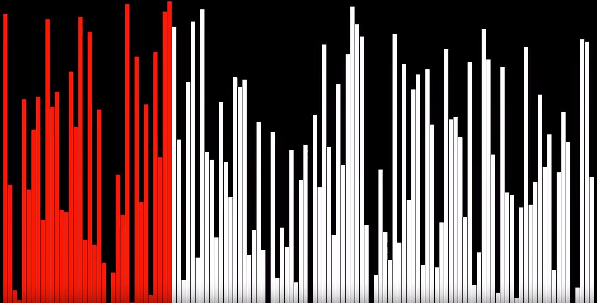

<div align=center>

# 2주차-정렬 알고리즘

</div>

<br>

## 정렬 참고 사이트
- [영상으로 보는 자료구조와 알고리즘](https://visualgo.net/ko)

<br>

## 정렬 알고리즘
> 이진 탐색이 가능한 데이터를 만들기 위해 필요한 절차

<div align=center>

[](https://www.youtube.com/watch?v=kPRA0W1kECg)

</div>

<br>

### O(n²)
> 계산 시간이 정렬할 자료 수의 제곱에 비례하여 증가
>> 1만 개를 1초에 정렬하면 10만 개를 정렬하는 데에는 100초 정도가 필요

- [버블 정렬](https://youtu.be/lyZQPjUT5B4)
  - 인접한 두 개의 데이터를 비교해가면서 정렬을 진행하는 방식
  - 가장 큰 값을 배열의 맨 끝에다 이동시키면서 정렬하고자 하는 원소의 개수 만큼 두 번 반복한다.

- [선택 정렬](https://youtu.be/Ns4TPTC8whw)
  - 데이터를 계속해서 바꾸는 것이 아니라 비교하고 있는 값의 index 를 저장한다.
  - 최종적으로 저장된 인덱스를 한 번만 바꿔준다.

- [삽입 정렬](https://youtu.be/ROalU379l3U)
  - k번째 원소를 1부터 k-1까지와 비교해 적절한 위치에 끼워넣고 그 뒤의 자료를 한 칸씩 뒤로 밀어내는 방식

<br>

### O(n log n)
> 입력값 n 이 주어졌을 때, 문제를 해결하는데 필요한 단계들이 연산의 특정 요인에 의해 감소

- [병합 정렬](https://youtu.be/XaqR3G_NVoo)
  - 정렬하고자 하는 배열의 크기를 작은 단위로 나누어 정렬하고자 하는 배열의 크기를 줄이는 원리

- [힙 정렬](https://youtu.be/6NB0GHY11Iw) : 두 가지 방식이 존재
  1. 정렬의 대상인 데이터들을 힙에 넣었다가 꺼내는 원리
  2. 기존의 배열을 heapify(heap 으로 만들어주는 과정)을 거쳐 꺼내는 원리

- [퀵 정렬](https://youtu.be/ywWBy6J5gz8)
  - 적절한 원소 하나를 기준(피벗, pivot)으로 삼아 그보다 작은 것을 앞으로 빼내고 그 뒤에 피벗을 옮겨 피벗보다 작은 것, 큰 것으로 나눈뒤 나누어진 각각에서 다시 피벗을 잡고 정렬해서 각각의 크기가 0이나 1이 될 때까지 정렬

<hr>
<br>

# 2주차 - 문제풀기(정렬)
- 1번 - 정렬 기초
    ```
    - "최댓값과 최솟값 구하기"
    ```
    ```java
    // 주어지는 값
    int[] n = {8,1,45,21,22,37,6,8,2,79};
    
    void solution1(int[] n){
        int maxNum = 0
        int minNum = 0;

        // 코드 작성

        System.out.println("최댓값은 : " + maxNum);
        System.out.println("최솟값은 : " + minNum);
    }
    ```

- 2번 - 배열 기초
    ```
    - "1+2+4+7+11+16+...+i 의 순서로 나열된 수열의 i번째 항까지의 합 구하기"
    ```
    ```java
    // 주어지는 값
    int i = 10; // 10번째 항까지의 합

    void solution2(int i){
        int sumValue = 0;

        // 코드 작성

        System.out.println(i + "번째 항까지의 합 : " + sumValue);
    }
    ```

- 3번 - 배열 기초
    ```
    - "1-2+3-4+5-6+...+99-100의 합 구하기"
    ```
    ```java
    // 주어지는 값 없음

    void solution3(){
        int sumValue = 0;

        // 코드 작성

        System.out.println("총합 : " + sumValue);
    }
    ```

- 4번 - 정렬 기초
    ```
    - "int 배열이 주어졌을 때, 이를 오름차순으로 정렬하는 프로그램을 작성하시오."
    ```
    ```java
    // 주어지는 값
    int[] n = {8,1,45,21,22,37,6,8,2,79};
    
    void solution4(int[] n){
        int[] answer = {};

        // 코드 작성

        for(int answers : answer)
            System.out.print(answers + ", ");
    }
    ```

- [5번 - 백준알고리즘](https://www.acmicpc.net/problem/1181)
    ```
    - "알파벳 소문자로 이루어진 N개의 단어가 들어오면 아래와 같은 조건에 따라 정렬하는 프로그램을 작성하시오."
      * > 길이가 짧은 것부터
      * > 길이가 같으면 사전 순으로
    ```
    ```java
    // 스캐너 사용시
    void solution5(){
        Scanner sc = new Scanner(System.in);
        int count = Integer.parseInt(sc.nextLine().trim());

        // 코드 작성
    }

    // 버퍼드리더 사용시
    void solution5(){
        BufferedReader br = new BufferedReader(new InputStreamReader(System.in));
        int n = Integer.parseInt(br.readLine());

        // 코드 작성
    }
    ```

- 6번 - 정렬 기초
    ```
    - "수가 주어지면, 그 수의 각 자리수를 내림차순으로 정렬하시오."
    ```
    ```java
    // 주어지는 값
    int n = 153248976

    void solution6(int n){
        String answer = "";

        // 코드 작성

        System.out.println("정렬된 수 : " + answer);
    }
    ```

- [7번 - 프로그래머스](https://programmers.co.kr/learn/courses/30/lessons/42746)
    ```
    - "0 또는 양의 정수가 주어질 때, 정수를 이어 붙여 만들 수 있는 가장 큰 수를 출력하시오."
      * > 주어진 정수가 [6, 10, 2]라면 [6102, 6210, 1062, 1026, 2610, 2106]를 만들 수 있고, 이중 가장 큰 수는 6210이다.
      * > 0 또는 양의 정수가 담긴 배열 n이 매개변수로 주어질 때, 순서를 재배치하여 만들 수 있는 가장 큰 수를 문자열로 바꾸어 return 하도록 solution 함수를 작성하시오.
    ```
    ```java
    // 주어지는 값
    int[] n = {3, 30, 34, 5, 9};

    String solution7(int[] n){
        String answer = "";

        // 코드 작성

        System.out.println("정수를 이어 붙여 만든 가장 큰 수는 : " + answer);
        return answer;
    }
    ```

<hr>
<br>

[뒤로가기](../curriculum.md)

<br>