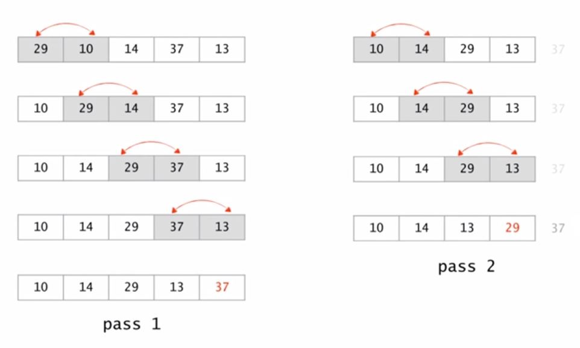
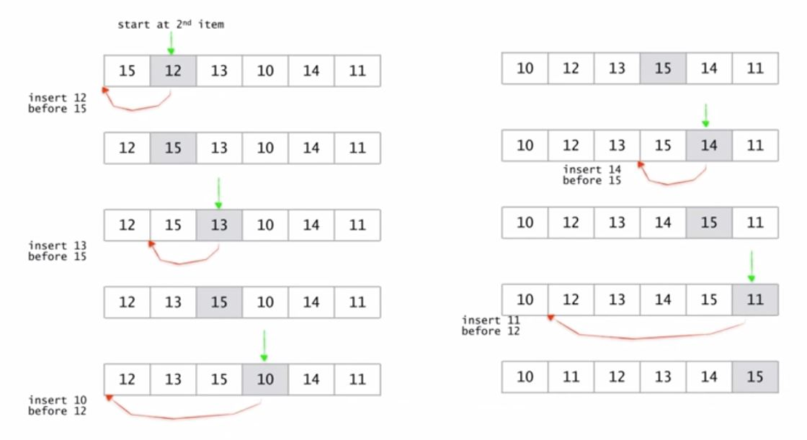
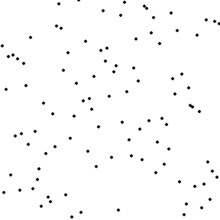
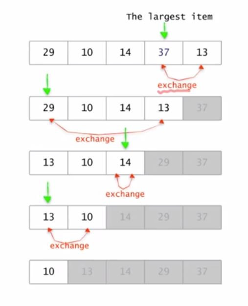

<div align=center>

# 3주차-정렬 알고리즘 구현

</div>

<br>

## 정렬 알고리즘
<table>
    <thead> 
    <tr> 
        <th>분류</th> 
        <th>알고리즘</th> 
    </tr> 
    </thead> 
    <tbody> 
    <tr> 
        <td rowspan=3>단순하지만 느림<br>O(n²)</td> 
        <td>거품 정렬(Bubble Sort)</td> 
    </tr> 
    <tr> 
        <td>삽입 정렬(Insertion) Sort)</td> 
    </tr> 
    <tr> 
        <td>선택 정렬(Selection Sort)</td>
    </tr> 
    <tr>
        <td rowspan=3>복잡하지만 빠름<br>O(n log n)</td>
        <td>퀵 정렬(Quick Sort)</td> 
    </tr> 
    <tr>
        <td>합병 정렬(Merge Sort)</td>
    </tr>
    <tr> 
        <td>힙 정렬(Heap Sort)</td>
    </tr> 
    <tr>
        <td>평균<br>O(n)</td>
        <td>라딕스 정렬(Radix Sort)</td> 
    </tr> 
    </tbody>
</table>

<hr>
<br>

## Java의 정렬
### 기본 타입 데이터의 정렬
- Arrays 클래스는 primitive 타입 데이터를 위한 정렬 메서드 제공
    ```java
    // 정렬할 데이터
    int[] data = new int[capacity];

    // data[0]에서 data[capacity-1]까지 데이터가 꽉 차 있는 경우
    Arrays.sort(data);
    // data[0]에서 data[size-1]까지 size개의 데이터만 있는 경우
    Arrays.sort(data, 0, size);
    ```
    - int 이외의 다른 primitive 타입 데이터(double, char)에 대해서도 제공

<br>

### 객체의 정렬 : 문자열
- primitive 타입 데이터와 마찬가지로 Arrays.sort 메서드로 정렬
    ```java
    // 정렬할 데이터
    String[] fruits = new String[] {"pineapple", "apple", "orange", "banana"};

    Arrays.sort(fruits);

    for(String name : fruits)
        System.out.println(name);
    ```

<br>

### ArrayList 정렬 : 문자열
- Collections.sort 메서드로 정렬
    ```java
    // 정렬할 데이터의 저장공간
    List<String> fruits = new ArrayList<String>();

    // 정렬할 데이터
    fruits.add("Pineapple");
    fruits.add("Apple");
    fruits.add("Orange");
    fruits.add("Banana");  

    Collections.sort(fruits);

    for(String name: fruits)
        System.out.println(name);
    ```

<br>

### 객체의 정렬 : 사용자 정의 객체
#### 오류가 나는 정렬
```java
// 사용자 정의 객체 생성
public class Fruit
{       
    public String name;
    
    public int quantity;
    
    public Fruit(String name, int quantity)
    {
        
        this.name = name;
        
        this.quantity = quantity;
        
    }
}

//====================================================//

// 실행 테스트 클래스
public class test()
{
    public static void main(String[] args)
    {
        Fruit[] fruits = new Fruit[4];
        
        fruits[0] = new Fruit("Pineapple", 70);
        fruits[1] = new Fruit("Apple", 100);
        fruits[2] = new Fruit("Orange", 80);
        fruits[3] = new Fruit("Banana", 90);
        
        Arrays.sort(fruits);
        
    }
}
```

<br>

#### 오류가 나지 않는 정렬
- 이름순 정렬
    ```java
    // 사용자 정의 객체 생성
    public class Fruit implements Comparable<Fruit>
    {
        public String name;
        
        public int quantity;
        
        public Fruit(String name, int quantity)
        {
            
            this.name = name;
            
            this.quantity = quantity;
            
        }
        
        @Override
        public int compareTo(Fruit o)
        {
            return name.compareTo(o.name);
        }
        
    }

    //====================================================//

    // 실행 테스트 클래스, 위와 동일하므로 생략
    ```

- 재고 수량별 정렬
    ```java
    // 사용자 정의 객체 생성
    public class Fruit implements Comparable<Fruit>
    {
        public String name;
        
        public int quantity;
        
        public Fruit(String name, int quantity)
        {
            
            this.name = name;
            
            this.quantity = quantity;
            
        }
        
        @Override
        public int compareTo(Fruit o)
        {
            return quantity - o.quantity;
        }
        
    }

    //====================================================//

    // 실행 테스트 클래스, 위와 동일하므로 생략
    ```

#### 하나의 객체 타입에 2가지 이상의 기준으로 정렬
```
1. Comparator 클래스 extends
2. compare 메서드를 Override하는 새로운 이름 없는 클래스를 정의
3. 해당 클래스의 객체를 생성한다.

- 그렇다면 Comparator 객체들은 어디에 둘 것인가?
    : 데이터 객체의 static member로 둔다.
    : 정렬 시 Arrays.sort(fruits, Fruit.xxxComparator); 로 사용한다.
```
- **Comparator**의 사용
    ```java
    public class Fruit
    {
        public String name;
        
        public int quantity;
        
        public Fruit(String name, int quantity)
        {
            
            this.name = name;
            
            this.quantity = quantity;
            
        }
        
        // Comparator의 익명 클래스 정의 후 compare 메서드 재정의(이름순)
        public static Comparator<Fruit> nameComparator = new Comparator<Fruit>() {
            
            @Override
            public int compare(Fruit o1, Fruit o2)
            {
                return o1.name.compareTo(o1.name);
            }
        };
        
        // Comparator의 익명 클래스 정의 후 compare 메서드 재정의(재고 수량별)
        public static Comparator<Fruit> quantityComparator = new Comparator<Fruit>() {
            
            @Override
            public int compare(Fruit o1, Fruit o2)
            {
                return o1.quantity - o2.quantity;
            }
        };
        
    }

    //====================================================//

    // 실행 테스트 클래스
    public class test()
    {
        public static void main(String[] args)
        {
            Fruit[] fruits = new Fruit[4];
            
            fruits[0] = new Fruit("Pineapple", 70);
            fruits[1] = new Fruit("Apple", 100);
            fruits[2] = new Fruit("Orange", 80);
            fruits[3] = new Fruit("Banana", 90);
            
            Arrays.sort(fruits, nameComparator);
            // OR
            Arrays.sort(fruits, quantityComparator);
        }
    }
    ```

<hr>
<br>

## C#의 정렬
### 기본 타입 데이터의 정렬
- Array 클래스는 primitive 타입 데이터를 위한 정렬 메서드 제공
    ```cs
    // 정렬할 데이터
    int[] data = new int[capacity];

    // data[0]에서 data[capacity-1]까지 데이터가 꽉 차 있는 경우
    Array.Sort(data);
    // data[0]에서 data[size-1]까지 size개의 데이터만 있는 경우
    Array.Sort(data, 0, size);
    ```
    - int 이외의 다른 primitive 타입 데이터(double, char)에 대해서도 제공

<br>

### 객체의 정렬 : 문자열
- primitive 타입 데이터와 마찬가지로 Array.Sort 메서드로 정렬
    ```cs
    // 정렬할 데이터
    String[] fruits = new String[] {"pineapple", "apple", "orange", "banana"};

    Array.Sort(fruits);

    foreach(String name in fruits)
        Console.WriteLine(name);
    ```

<br>

### ArrayList 정렬 : 문자열
- Sort() 메서드로 정렬
    ```cs
    // 정렬할 데이터의 저장공간
    ArrayList fruits = new ArrayList();

    // 정렬할 데이터
    fruits.Add("Pineapple");
    fruits.Add("Apple");
    fruits.Add("Orange");
    fruits.Add("Banana");  

    fruits.Sort();

    foreach(String name in fruits)
        Console.WriteLine(name);
    ```

<br>

### 객체의 정렬 : 사용자 정의 객체
#### 오류가 나는 정렬
```cs
// 사용자 정의 객체 생성
public class Fruit
{       
    public String name;
    public int quantity;

    public Fruit(String name, int quantity)
    {
        this.name = name;
        this.quantity = quantity;
    }
}

//====================================================//

// 실행 테스트 클래스
public class test()
{
    public static void Main(string[] args)
    {
        Fruit[] fruits = new Fruit[4];

        fruits[0] = new Fruit("Pineapple", 70);
        fruits[1] = new Fruit("Apple", 100);
        fruits[2] = new Fruit("Orange", 80);
        fruits[3] = new Fruit("Banana", 90);

        Array.Sort(fruits);

        foreach (Fruit member in fruits)
        {
            Console.WriteLine(member);
        }
    }
}
```

<br>

#### 오류가 나지 않는 정렬
- 이름순 정렬
    ```cs
    // 사용자 정의 객체 생성, IComparable 구현
    public class Fruit : IComparable<_Fruit>
    {       
        public String name;
        public int quantity;

        public Fruit(String name, int quantity)
        {
            this.name = name;
            this.quantity = quantity;
        }

        // 정렬을 위한 객체 구현
        public int CompareTo(_Fruit o)
        {
            return name.CompareTo(o.name);
        }
    }

    //====================================================//

    // 실행 테스트 클래스, 위와 동일하므로 생략
    ```

- 재고 수량별 정렬
    ```cs
    // 사용자 정의 객체 생성, IComparable 구현
    public class Fruit : IComparable<_Fruit>
    {       
        public String name;
        public int quantity;

        public Fruit(String name, int quantity)
        {
            this.name = name;
            this.quantity = quantity;
        }

        // 정렬을 위한 객체 구현
        public int CompareTo(_Fruit o1, _Fruit o2)
        {
            return o1.quantity - o2.quantity;
        }
    }

    //====================================================//

    // 실행 테스트 클래스, 위와 동일하므로 생략
    ```

#### 하나의 객체 타입에 2가지 이상의 기준으로 정렬
```
1. Comparer 클래스 extends
2. Compare 메서드를 override 하는 새로운 이름 없는 클래스를 정의
3. 해당 클래스의 객체를 생성한다.

- 그렇다면 Comparer 객체들은 어디에 둘 것인가?
    : 데이터 객체의 member로 둔다.
    : 정렬 시 Array.sort(fruits, new xxxComparer()); 로 사용한다.
```
- **Comparer**의 사용
    ```cs
    public class Fruit
    {
        public String name;
        
        public int quantity;
        
        public Fruit(String name, int quantity)
        {
            
            this.name = name;
            
            this.quantity = quantity;
            
        }
        
        // Comparer의 익명 클래스 정의 후 Compare 메서드 재정의(이름순)
        public class nameComparer : Comparer<Fruit>
        {
            public override int Compare(Fruit o1, Fruit o2)
            {
                return String.Compare(o1.name, o2.name);
            }
        }
        
        // Comparer의 익명 클래스 정의 후 Compare 메서드 재정의(재고 수량별)
        public class quantityComparer : Comparer<Fruit>
        {
            public override int Compare(Fruit o1, Fruit o2)
            {
                return o1.quantity - o2.quantity;
            }
        }
        
    }

    //====================================================//

    // 실행 테스트 클래스
    public class test()
    {
        public static void Main(string[] args)
        {
            Fruit[] fruits = new Fruit[4];

            fruits[0] = new Fruit("Pineapple", 70);
            fruits[1] = new Fruit("Apple", 100);
            fruits[2] = new Fruit("Orange", 80);
            fruits[3] = new Fruit("Banana", 90);

            Array.Sort(fruits, new nameComparer());
            // OR
            Array.Sort(fruits, new quantityComparer());

            foreach (Fruit member in fruits)
            {
                Console.WriteLine(member);
            }
        }
    }
    ```

<hr>
<br>

## 거품 정렬
<div align=center>


</div>

<br>

- 각 루프 시 행동
  - 인접한 원소를 비교하여 큰 값을 오른쪽으로 이동시킨다.
  - 다음 회차 루프때 맨 왼쪽 원소를 제외한다.

- 루프의 시작이 맨 오른쪽이 될 때까지 반복한다.

<br>

<div align=center>



</div>

<hr>

```java
// 방법 1
public static void bubbleSort(int[] n)
{
    // 임시로 저장할 변수 선언
    int temp = 0;
    // 정렬이 필요한 배열의 길이만큼 루프
    for (int i = 0; i < n.length; i++)
    {
        // 순회하면서 비교할 실제 루프
        for (int j = i + 1; j < n.length; j++)
        {
            // 전 요소의 값이 크면
            if (n[i] > n[j])
            {
                // 임시 변수에 작은 원소의 값을 저장하고
                temp = n[j];
                // 작은 원소의 위치에 큰 원소의 값을 저장하고
                n[j] = n[i];
                // 큰 원소의 위치에 임시 변수의 값을 저장
                n[i] = temp;
            }
        }
    }
}

// 방법 2
public static void bubbleSort2(int[] n)
{
    // flag 변수
    boolean switched;
    do
    {
        // 반복문을 끝낼 수 있게 false로 변환
        switched = false;
        // 정렬이 필요한 배열의 길이만큼 루프
        for (int i = 0; i < n.length - 1; i++)
        {
            if (n[i + 1] < n[i])
            {
                // 임시 변수를 선언하면서 작은 원소 값을 저장하고
                int tmp = n[i + 1];
                // 작은 원소의 위치에 큰 원소의 값을 저장하고
                n[i + 1] = n[i];
                // 큰 원소의 위치에 임시 변수의 값을 저장
                n[i] = tmp;
                // 교환이 되었으므로 flag를 true로 변환하여 루프 반복
                switched = true;
            }
        }
    // 교환이 없을 때까지 반복
    } while (switched);
}
```

<br>

## 삽입 정렬
<div align=center>


</div>

<br>

- 각 루프 시 행동
  - 시작회차 + 1의 위치 원소를 정렬된 배열과 비교한다.
  - 자신의 위치를 찾아 삽입한다.

- 루프의 시작이 맨 오른쪽이 될 때까지 반복한다.

<br>

<div align=center>



</div>

<hr>

```java
public static void insertionSort(int[] n)
{
    // 정렬이 필요한 배열의 길이만큼 루프, 2번째 원소부터 시작하므로 i 는 1로 초기화
    for (int i = 1; i < n.length; i++)
    {
        // 루프하며 비교할 원소
        int key = n[i];
        // 비교 대상이 되는 i 보다 앞에 있는 원소의 위치
        int j = i - 1;
        // j 가 0보다 작아질 때까지 반복
        while (j >= 0)
        {
            // 비교할 원소 값보다 비교 대상의 값이 크면
            if(n[j] > key)
            {
                // 비교 대상의 값을 key와 n[j] 사이에 삽입
                n[j + 1] = n[j];
                // j 감소
                j--;
            }
        }
        // 루프가 끝나면 key 값을 삽입
        n[j + 1] = key;
    }
}
```

<br>

## 선택 정렬
<div align=center>



</div>

<br>

- 각 루프 시 행동
  - 루프의 최대 원소를 찾는다.
  - 최대 원소와 맨 오른쪽 원소를 교환한다.
  - 맨 오른쪽 원소를 제외한다.

- 하나의 원소만 남을 때까지 위의 루프를 반복한다.

<br>

<div align=center>



</div>

<hr>

```java
public static void selectionSort(int[] n)
{
    // 임시로 저장할 변수 선언
    int temp = 0;

    // 정렬이 필요한 배열의 길이만큼 루프
    for (int i = 0; i < n.length; i++)
    {
        // 최솟값의 위치를 저장할 변수
        int min = i;
        // 배열의 끝에서부터 i 위치까지 비교할 루프
        for (int j = n.length - 1; j > i; j--)
        {
            // 비교하는 값이 최솟값보다 작으면
            if (n[j] < n[min])
                // 서로의 위치 값을 변경
                min = j;
        }
        // 임시 변수에 현재 값 저장
        temp = n[i];
        // i의 원소 값은 최솟값이 되어야 하므로 교환
        n[i] = n[min];
        // 최솟값이었던 원소에 임시 변수의 값을 저장
        n[min] = temp;
    }
}
```

<br>

## 퀵 정렬
<div align=center>


</div>

<br>

- 임의의 pivot 값을 지정한다.

- 각 루프 시 행동
  - pivot 보다 큰 값을 pivot index 보다 왼쪽에서 찾아 큰 값이 나타날 때까지 i(index)를 증가시킨다.
  - pivot 보다 작은 값을 pivot index 보다 오른쪽에서 찾아 작은 값이 나타날 때까지 j(index)를 감소시킨다.
  - pivot 을 기준으로 값 비교가 완료되었다면 index 결과 i , j 를 비교한다.
  - i 값이 j 값보다 작거나 같다면 pivot 을 기준으로 교환을 해야 할 값이 존재한다는 뜻이다.
  - 값을 교환한 뒤 i 는 증가, j 는 감소시킨다.
  
- i 가 j 보다 클 때까지 반복한다.

<br>

<div align=center>


</div>

<hr>

```java
// 퀵 정렬 : 리스트 형태
public static List<Integer> quickSort(List<Integer> n)
{
    // 재귀를 끝낼 조건, 리스트의 크기가 1이하라면 정렬할 필요가 없음
    if (n.size() < 2)
        return n;
    
    // 임의의 기준 정의
    int pivot = n.get(0);
    
    // 피봇을 기준으로 왼쪽에 위치할 리스트
    List<Integer> lower = new ArrayList<Integer>();
    // 피봇을 기준으로 오른쪽에 위치할 리스트
    List<Integer> higher = new ArrayList<Integer>();
    
    // 정렬이 필요한 리스트의 크기만큼 루프, 피봇을 0으로 잡았으니 i 는 1부터 시작
    for (int i = 1; i < n.size(); i++)
    {
        // 피봇보다 현재의 값이 작으면
        if (pivot > n.get(i))
            // 왼쪽에 추가
            lower.add(n.get(i));
        else
            // 아니라면 오른쪽에 추가
            higher.add(n.get(i));
    }
    
    // 왼쪽에 위치하는 리스트를 재귀하여 정렬된 형태로 구현
    List<Integer> answer = quickSort(lower);
    // 피봇의 값은 중간에 위치해야함
    answer.add(pivot);
    // 나머지의 값은 오른쪽에 위치하므로 전체 리스트를 합침
    answer.addAll(quickSort(higher));
    
    // 합친 리스트를 반환
    return answer;
}

// 퀵 정렬 : 배열 형태
public static void quickSort(int n[], int lower, int higher)
{
    // lower의 값이 higher의 크기보다 크다면
    if (lower < higher)
    {
        // 피봇은 배열을 분할하여 반환된 값으로 선언
        int pivot = partition(n, lower, higher);
        
        // 왼쪽에 위치하는 배열을 재귀하여 정렬
        quickSort(n, lower, pivot - 1);
        // 오른쪽에 위치하는 배열을 재귀하여 정렬
        quickSort(n, pivot + 1, higher);
    }
    
}

// 퀵 정렬 : 재귀호출(분할)
public static int partition(int[] n, int lower, int higher)
{
    // 피봇의 값은 배열의 중앙
    int pivot = n[(lower + higher) / 2];
    // 왼쪽 기준 값이 오른쪽 기준 값보다 작을 때까지 반복
    while (lower < higher)
    {
        // 피봇보다 왼쪽의 원소가 작다면 lower를 증가
        while ((n[lower] < pivot) && (lower < higher))
            lower++;
        // 피봇보다 오른쪽의 원소가 크다면 higher를 감소
        while ((n[higher] > pivot) && (lower < higher))
            higher--;
        
        if (lower < higher)
        {
            // 교환
            int temp = n[lower];
            n[lower] = n[higher];
            n[higher] = temp;
        }
    }

    // while문이 끝나는 시점은 lower가 higher와 같아질 때
    return lower;
}
```

<br>

## 분할-정복(Divide and Conquer) 알고리즘이란?
- 해결하기 힘든 주 문제를 부 문제로 분할하여 해결하는 방법

- 보통 재귀 함수(Recursive Function)로 구현
  - 부 문제로 분할하여 적용할 알고리즘은 임의로 선택 가능
  - 재귀 호출을 사용한 함수는 함수 호출 오버헤드 때문에 실행 속도 감소
  - 빠른 실행이나 부 문제 해결 순서 선택을 위해 재귀 호출이 아닌 스택(Stack), 큐(Queue) 등의 자료구조를 이용하여 분할 정복법을 구현하는 것도 가능

- 의사코드 표현
    ```js
    function F(x):
    if F(x)의 문제가 간단 then:
        return F(x)을 직접 계산한 값
    else:
        x 를 y1, y2로 분할
        F(y1)과 F(y2)를 호출
        return F(y1), F(y2)로부터 F(x)를 구한 값
    ```

<hr>
<br>

## 합병 정렬
<div align=center>


</div>

<br>

- 리스트의 길이가 1 이하이면 이미 정렬된 것으로 본다. 그렇지 않은 경우에는
- 분할(divide) : 정렬되지 않은 리스트를 절반으로 잘라 비슷한 크기의 두 부분 리스트로 나눈다.
- 정복(conquer) : 각 부분 리스트를 재귀적으로 합병 정렬을 이용해 정렬한다.
- 결합(combine) : 두 부분 리스트를 다시 하나의 정렬된 리스트로 합병한다. 이때 정렬 결과가 임시배열에 저장된다.
- 복사(copy) : 임시 배열에 저장된 결과를 원래 배열에 복사한다.

<br>

<div align=center>


</div>

<hr>

```java
// 병합 정렬 호출
public static void mergeSort(int[] arr)
{
    // 정렬에 사용할 동일한 길이의 배열 선언
    int[] temp = new int[arr.length];
    // 재귀함수 호출
    mergeSort(arr, temp, 0, arr.length - 1);
}

// 병합 정렬 시작
public static void mergeSort(int[] arr, int[] temp, int start, int end)
{
    // 시작 위치 값이 종료 위치 값보다 작을 때까지
    if (start < end)
    {
        // 중앙값 변수 선언
        int mid = (start + end) / 2;
        // 처음부터 중앙값까지의 원소를 재귀하여 정렬
        mergeSort(arr, temp, start, mid);
        // 중앙값 이후부터 끝까지의 원소를 재귀하여 정렬
        mergeSort(arr, temp, mid + 1, end);
        // 정렬된 배열을 병합
        merge(arr, temp, start, mid, end);
    }
}

// 정렬된 배열 병합 실행
public static void merge(int[] arr, int[] temp, int start, int mid, int end)
{
    // 배열을 그대로 복사
    // java 의 경우 Arrays.copyOf 쓰면 됨
    for (int i = start; i <= end; i++)
    {
        temp[i] = arr[i];
    }

    // 왼쪽의 시작 위치 값 저장
    int part1 = start;
    // 오른쪽의 시작 위치 값 저장
    int part2 = mid + 1;
    // 절대 위치 값 저장
    int index = start;

    // 왼쪽 시작 위치 값이 중앙에 다다르거나 오른쪽 시작 위치 값이 끝에 다다를 때까지
    while (part1 <= mid && part2 <= end)
    {
        // 왼쪽과 오른쪽의 원소 값을 비교
        if (temp[part1] <= temp[part2])
        {
            // 왼쪽이 작거나 같으면 실제 배열의 절대 위치에 값을 저장하고
            arr[index] = temp[part1];
            // 왼쪽 시작 위치 값을 증가
            part1++;
        }
        // 아니라면
        else
        {
            // 실제 배열의 절대 위치에 오른쪽 시작 값을 저장하고
            arr[index] = temp[part2];
            // 오른쪽 시작 위치 값을 증가
            part2++;
        }
        // 루프가 돌 때마다 절대 위치값을 증가
        index++;
    }

    // part1은 while 루프가 끝난 시점이므로 mid와 같거나 작은 값임
    for (int i = 0; i <= mid - part1; i++)
    {
        // 실제 배열의 절대 위치에 i 값을 더한 위치는 중앙과 같음
        // 값을 옮겨 담아서 저장
        arr[index + i] = temp[part1 + i];
    }
}
```

<br>

## ~~힙 정렬~~(개념만 인지)
<div align=center>


</div>

<br>

1. n개의 노드에 대한 완전 이진 트리를 구성한다. 이때 루트 노드부터 부모노드, 왼쪽 자식노드, 오른쪽 자식노드 순으로 구성한다.
2. 최대 힙을 구성한다. 최대 힙이란 부모노드가 자식노드보다 큰 트리를 말하는데, 단말 노드를 자식노드로 가진 부모노드부터 구성하며 아래부터 루트까지 올라오며 순차적으로 만들어 갈 수 있다.
3. 가장 큰 수(루트에 위치)를 가장 작은 수와 교환한다.
4. 2와 3을 반복한다.

<br>

<div align=center>

<h2> 삽입 </h2>


<br>
<h2> 삭제 </h2>


</div>

<hr>
<br>

# 3주차 - 과제(정렬)
- 1, 2주차 문제를 정렬 알고리즘으로 해결하라.
  - 좀 더 효율적인 수단을 사용하여 시간을 단축하라.

<hr>
<br>

[뒤로가기](../curriculum.md)

<br>