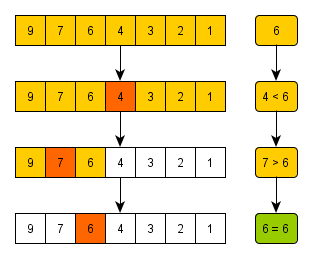

<div align=center>

# 4주차-검색 알고리즘의 구현

</div>

<br>

## 검색 알고리즘
- 아이디를 모르는 한국인 동갑친구 A의 SNS를 찾는다고 가정해보자. 찾는 순서는 아래와 같다.
    ```
    1. 나라를 찾는다. 혹은 언어의 발음을 비교하여 한국인을 찾는다.
    2. 프로필 사진이 친구이거나 또래인 사람을 찾는다.
    3. 친구의 이름, 생년월일 등 친구인 것 같은 아이디를 찾는다.
    ```
    - 위와 같이 어떤 검색을 하여도 특정 항목에 주목하는 것은 '검색'의 특징이다.
    - 주목하는 항목을 '키(key)'라고 지칭하고, 검색 과정을 살펴보자.
        ```
        1. 키 값과 일치하도록 지정(국가)
        2. 키 값의 구간을 지정(또래의 나이대)
        3. 키 값과 비슷하도록 지정(친구가 사용할 것 같은 아이디)
        ```
    - 물론, 조건은 하나일 수도 있지만 여러 개일 수도 있다.

- 검색 기법에서의 몇몇은 자료구조에 의존한다. 스터디에서는 **배열의 검색**을 다룬다.

<br>

## 배열의 검색 종류
### 선형 검색
- 무작위로 늘어놓은 데이터 집합에서 검색 수행

### 이진 검색
- 정렬된 데이터 집합에서 빠른 검색 수행

### 해시법
- 추가, 삭제가 자주 일어나는 데이터 집합에서 빠른 검색 수행
  - 체인법 : 같은 해시 값의 데이터를 선형 리스트로 연결하는 방법
  - 오픈 주소법 : 데이터를 위한 해시 값이 충돌할 때 재해시하는 방법

<br>

## 선형 검색(Linear Search)
- 요소가 직선 모양으로 늘어선 배열에서의 검색
  - 원하는 키(조건) 값을 갖는 요소를 만날 때까지 맨 앞부터 순서대로 요소를 검색
  - 선형 검색(Linear Search) 또는 순차 검색(Sequential Search)이라고 함

<div align=center>


</div>

<br>

- 위의 예제로 보는 선형 검색의 종료 조건
  - 조건 1 : 검색할 값을 발견하지 못하고 배열의 끝에 도달한 경우(검색 실패)
  - 조건 2 : 검색할 값과 같은 요소를 발견한 경우(검색 성공)

- 실습
    ```java
    public static int seqSearch(int[] n, int t)
    {
        int i = 0;
        
        while (true)
        {
            if (i == n.length)
                return -1;
            if (n[i] == t)
                return i;
            
            i++;
        }
    }
    ```

### 보초법
- 선형 검색의 종료 조건 검사 비용을 50%로 줄이는 방법
  - 검색하고자 하는 키 값을 맨 끝 요소에 저장
  - 이 경우 조건 1을 검사하지 않고 조건 2만 검사

- 실습
    ```java
    public static void main(String[] args)
    {
        int[] serachTargetArray = {6, 1, 2, 3, 4, 8, 9, 7, 5};
        int[] tempTargetArray = new int[searchTargetArray.length];

        for(int i = 0; i < serachTargetArray.length; i++)
            tempTargetArray[i] = serachTargetArray[i];

        seqSearchSen(tempTargetArray, 9);
    }

    public static int seqSearchSen(int[] n, int t)
    {
        n[n.length - 1] = t;

        int i = 0;
        
        while (true)
        {
            if (n[i] == t)
                break;
            i++;
        }
        
        return i == n.length ? -1 : i;
    }
    ```

<br>

## 이진 검색(Binary Search)
- 요소가 오름차순 또는 내림차순으로 정렬된 배열에서 적용하는 검색 알고리즘

<div align=center>



</div>

<br>

- 위의 예제로 보는 이진 검색의 종료 조건
  - 조건 1 : 검색 범위가 더 이상 없는 경우(검색 실패)
  - 조건 2 : 검색할 값과 배열의 중앙 값이 일치하는 경우(검색 성공)

- 실습
    ```java
    public static int binSearch(int[] n, int t)
    {
        int start = 0;
        int end = n.length - 1;
        
        do
        {
            int center = (start + end) / 2;
            
            if (n[center] == t)
                return center;
            else if (n[center] < t)
                start = center + 1;
            else
                end = center - 1;

        } while (start <= end);

        return -1;
    }
    ```

<br>

## 선형 검색과 이진 검색의 비교
<div align=center>


</div>

<br>

### 선형 검색의 시간 복잡도(Time Complexity)
- 코드
    ```java
    static int seqSearch(int[] n, int t)
    {
        int i = 0;                                  // 1
        while(i < n.length)                         // 2
        {
            if(n[i] == t)                           // 3
            {
                // 검색 성공
                return i;                           // 4
            }

            i++;                                    // 5
        }
        // 검색 실패
        return -1;                                  // 6
    }
    ```

- 선형 검색에서의 각 단계 실행 횟수와 복잡도

    |단계|실행 횟수|복잡도|
    |----|---------|------|
    |1|1|O(1)|
    |2|n/2|O(n)|
    |3|n/2|O(n)|
    |4|1|O(1)|
    |5|n/2|O(n)|
    |6|1|O(1)|

    ```
    O(1) + O(n) + O(n) + O(1) + O(n) + O(1) = O(max(1,n,n,1,n,1)) = O(n)
    ```

<br>

### 이진 검색의 시간 복잡도(Time Complexity)
- 코드
    ```java
    static int binSearch(int[] n, int t)
    {
        // 검색 범위의 시작(처음) 인덱스
        int start = 0;                              // 1
        // 검색 범위의 종료(끝) 인덱스
        int end = n.length -1;                      // 2

        do
        {
            // 중앙 요소의 인덱스
            int center = (start+end) / 2;           // 3
            
            if(n[center] == t)                      // 4
            {
                // 검색 성공
                return center;                      // 5
            }
            else if(n[center] < key)                // 6
            {
                // 검색 범위를 뒤쪽 반으로 좁힌다.
                start = center + 1;                 // 7
            }
            else{
                // 검색 범위를 앞쪽 반으로 좁힌다.
                end = center -1;                    // 8
            }
        }
        while(start <= end);                        // 9

        // 검색 실패
        return -1;                                  // 10
    }
    ```

- 이진 검색에서의 각 단계 실행 횟수와 복잡도

    |단계|실행 횟수|복잡도|
    |----|---------|------|
    |1|1|O(1)|
    |2|1|O(1)|
    |3|log n|O(log n)|
    |4|log n|O(log n)|
    |5|1|O(1)|
    |6|log n|O(log n)|
    |7|log n|O(log n)|
    |8|log n|O(log n)|
    |9|log n|O(log n)|
    |10|1|O(1)|

    ```
    O(1) + O(1) + O(log n) + ... + O(1) = O(log n)
    ```

<br>

### Big-O 의 대소 관계
<div align=center>

**`O(1)`** < **`O(log n)`** < **`O(n)`** < **`O(n log n)`** < **`O(n²)`** < **`O(2ⁿ)`** < **`O(n!)`** < **`O(nⁿ)`**

</div>

<hr>
<br>

# 4주차 - 문제(검색)
## [1번 - 프로그래머스](https://programmers.co.kr/learn/courses/30/lessons/42840)
- 문제 설명
  - 수포자는 수학을 포기한 사람의 준말입니다. 수포자 삼인방은 모의고사에 수학 문제를 전부 찍으려 합니다. 수포자는 1번 문제부터 마지막 문제까지 다음과 같이 찍습니다.
    ```
    1번 수포자가 찍는 방식: 1, 2, 3, 4, 5, 1, 2, 3, 4, 5, ...
    2번 수포자가 찍는 방식: 2, 1, 2, 3, 2, 4, 2, 5, 2, 1, 2, 3, 2, 4, 2, 5, ...
    3번 수포자가 찍는 방식: 3, 3, 1, 1, 2, 2, 4, 4, 5, 5, 3, 3, 1, 1, 2, 2, 4, 4, 5, 5, ...
    ```
  - 1번 문제부터 마지막 문제까지의 정답이 순서대로 들은 배열 answers가 주어졌을 때, 가장 많은 문제를 맞힌 사람이 누구인지 배열에 담아 return 하도록 solution 함수를 작성해주세요.

- 제한사항
  - 시험은 최대 10,000 문제로 구성되어있습니다.
  - 문제의 정답은 1, 2, 3, 4, 5중 하나입니다.
  - 가장 높은 점수를 받은 사람이 여럿일 경우, return하는 값을 오름차순 정렬해주세요.

<hr>

- java 풀이
    ```java
    import java.util.*;

    class Solution {
        public int[] solution(int[] answers) {
            int[] student1 = { 1, 2, 3, 4, 5 };
            int[] student2 = { 2, 1, 2, 3, 2, 4, 2, 5 };
            int[] student3 = { 3, 3, 1, 1, 2, 2, 4, 4, 5, 5 };
            
            int[] tempA = new int[3];
            
            for (int i = 0; i < answers.length; i++)
            {
                if (answers[i] == student1[i % 5])
                {
                    tempA[0]++;
                }
                if (answers[i] == student2[i % 8])
                {
                    tempA[1]++;
                }
                if (answers[i] == student3[i % 10])
                {
                    tempA[2]++;
                }
            }
            
            int temp = tempA[0];
            
            for (int i = 1; i < tempA.length; i++)
            {
                if (tempA[i] > temp)
                {
                    temp = tempA[i];
                }
            }
            
            List<Integer> answer = new ArrayList<Integer>();
            
            for (int i = 0; i < tempA.length; i++)
            {
                if (temp == tempA[i])
                {
                    answer.add(i + 1);
                }
                
            }
            
            int[] returnValue = new int[answer.size()];
            
            for (int i = 0; i < answer.size(); i++)
            {
                returnValue[i] = answer.get(i);
            }
            
            return returnValue;
        }
    }
    ```

- c# 풀이
    ```cs
    using System.Collections.Generic;
    using System.Linq;

    public class Solution {
        public int[] solution(int[] answers) {
    int[] student1 = { 1, 2, 3, 4, 5 };
                int[] student2 =  { 2, 1, 2, 3, 2, 4, 2, 5 };
                int[] student3 =  { 3, 3, 1, 1, 2, 2, 4, 4, 5, 5 };

                // 점수를 저장할 임시 배열 생성
                int[] tempArray = new int[3];

                // 문제와 답변을 완전 탐색하면서 수포자들의 답안 체크 후 점수 증가
                for (int i = 0; i < answers.Length; i++)
                {
                    // 1번 수포자 점수 증가
                    if (answers[i] == student1[i % 5])
                    {
                        tempArray[0]++;
                    }

                    // 2번 수포자 점수 증가
                    if (answers[i] == student2[i % 8])
                    {
                        tempArray[1]++;
                    }

                    // 3번 수포자 점수 증가
                    if (answers[i] == student3[i % 10])
                    {
                        tempArray[2]++;
                    }
                }

                int max = 0;

                for(int i = 0; i < tempArray.Length; i++)
                {
                    if (max < tempArray[i])
                        max = tempArray[i];
                }

                List<int> list = new List<int>();

                for(int i = 0; i < tempArray.Length; i++)
                {
                    if (max == tempArray[i])
                        list.Add(i + 1);
                }

                int[] answer = new int[list.Count];

                for (int i = 0; i < answer.Length; i++)
                {
                    answer[i] = list[i];
                }

                return answer;
        }
    }
    ```

<br>

## [2번 - 백준 알고리즘](https://www.acmicpc.net/problem/2805)
- 문제
  - 상근이는 나무 M미터가 필요하다. 근처에 나무를 구입할 곳이 모두 망해버렸기 때문에, 정부에 벌목 허가를 요청했다. 정부는 상근이네 집 근처의 나무 한 줄에 대한 벌목 허가를 내주었고, 상근이는 새로 구입한 목재절단기을 이용해서 나무를 구할것이다.

  - 목재절단기는 다음과 같이 동작한다. 먼저, 상근이는 절단기에 높이 H를 지정해야 한다. 높이를 지정하면 톱날이 땅으로부터 H미터 위로 올라간다. 그 다음, 한 줄에 연속해있는 나무를 모두 절단해버린다. 따라서, 높이가 H보다 큰 나무는 H 위의 부분이 잘릴 것이고, 낮은 나무는 잘리지 않을 것이다. 예를 들어, 한 줄에 연속해있는 나무의 높이가 20, 15, 10, 17이라고 하자. 상근이가 높이를 15로 지정했다면, 나무를 자른 뒤의 높이는 15, 15, 10, 15가 될 것이고, 상근이는 길이가 5인 나무와 2인 나무를 들고 집에 갈 것이다. (총 7미터를 집에 들고 간다)

  - 상근이는 환경에 매우 관심이 많기 때문에, 나무를 필요한 만큼만 집으로 가져가려고 한다. 이때, 적어도 M미터의 나무를 집에 가져가기 위해서 절단기에 설정할 수 있는 높이의 최댓값을 구하는 프로그램을 작성하시오.

- 입력
  - 첫째 줄에 나무의 수 N과 상근이가 집으로 가져가려고 하는 나무의 길이 M이 주어진다. (1 ≤ N ≤ 1,000,000, 1 ≤ M ≤ 2,000,000,000)

  - 둘째 줄에는 나무의 높이가 주어진다. 나무의 높이의 합은 항상 M을 넘기 때문에, 상근이는 집에 필요한 나무를 항상 가져갈 수 있다. 높이는 1,000,000,000보다 작거나 같은 양의 정수 또는 0이다.

- 출력
  - 적어도 M미터의 나무를 집에 가져가기 위해서 절단기에 설정할 수 있는 높이의 최댓값을 출력한다.

<hr>

- *해당 문제는 보류*

<hr>
<br>

[뒤로가기](../curriculum.md)

<br>